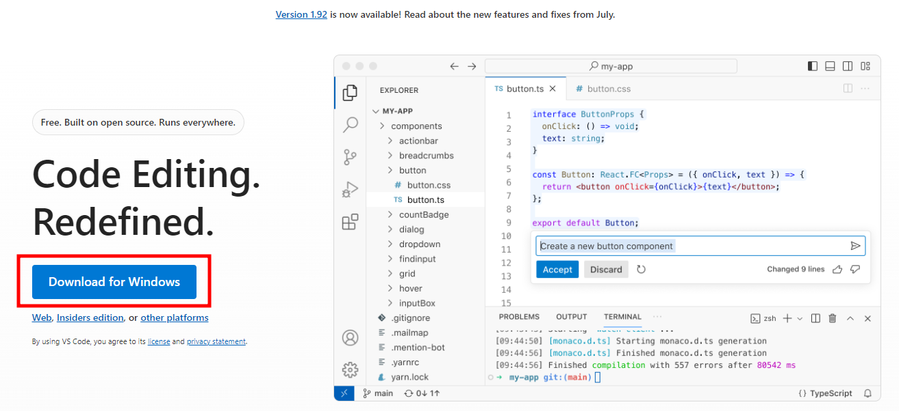
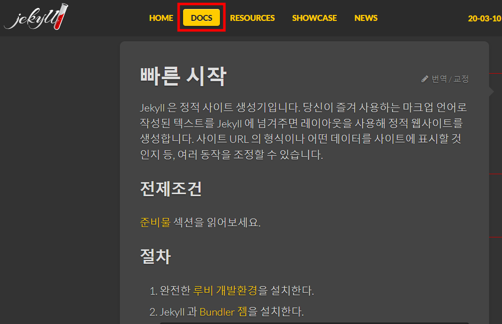
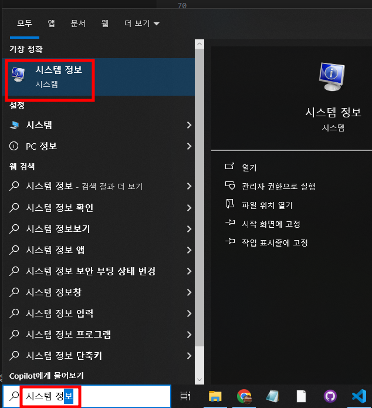
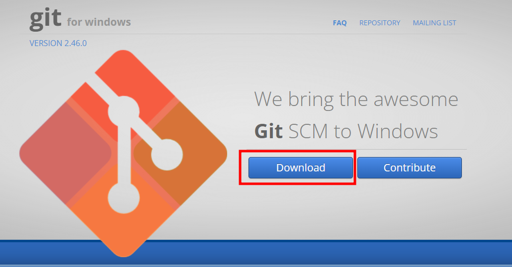

## 웹페이지란?
- 일종의 문서파일이다.
- 웹페이지를 작성하는 도구는 html이다.
- 웹페이지는 주로 원거리 통신을 통해 전달되는 경우가 많으며, 이 때 사용하는 방식을 HTTP라고 한다.
- 웹페이지는 글자와 사진뿐 아니라 동영상, 음악 등 다양한 정보를 아름다운 형태로 제공할 수 있다.
- 웹페이지들이 모여서 만들어진 덩어리를 웹사이트라고 한다.

## 웹개발자의 업무

### 프론트엔드 개발자
- 사용자가 직접적으로 눈으로 보며 사용하는 웹페이지를 개발하는 엔지니어이다.

### 백엔드 개발자
- 데이터를 저장하거나 프론트엔드의 원활한 활동을 도와주기 위한 서버를 개발하는 엔지니어이다.
- 바깥에서는 잘 보이지 않는 뒷단에서 작동하는 소프트웨어를 개발한다.

## 마크업언어란?
- 문서에 마크업을 추가하기 위해 사용하는 도구이다.
- 언어라고 이름이 붙은 이유는 사람과 컴퓨터가 서로 대화하기 위해 사용하는 도구이기 때문이다.
- 마크업은 교과서나 참고서의 중요한 부분에 밑줄을 긋거나 형광펜으로 칠하는 등 문서를 꾸미는 행위를 말한다.
- 웹페이지도 마크업 언어로 작성된 문서이다.

### 웹페이지의 원본 형태 들여다보기
- 익스플로러,엣지,크롬 등 웹브라우저를 활용해 아무 사이트에 들어가서 F12 버튼 눌러보기
- 상단에 요소 탭을 클릭한다.
- 요소 창에 보이는 글자들이 웹 페이지의 원본 마크업 언어이다.
- 프론트엔드 개발자는 마크업 문서를 작성하는 역할을 수행하는 사람이다.

### 개발의 기본은 협업이다.
- 현재 보는 페이지의 코드가 매우 복잡해보이지만 개발은 혼자하는 것이 아니다.
- 수십명의 개발자가 협업을 통해 제작한 작품이다.

## 웹 프론트엔드 개발을 위한 기본기
- HTML을 통해 웹 페이지를 제작해 볼 것입니다.
- 이후 CSS를 통해 HTML로 제작한 홈페이지에 디자인적 요소를 추가해 더욱 아름다운 웹페이지를 제작할 수 있다.
- 마지막으로 JS를 활용하면 웹 페이지에 각양각색의 기능들을 추가할 수 있다.
- 웹 페이지가 역동적으로 움직이고 변화하며, 우리와 상호작용 할 수 잇는 비밀이 JS덕분이다.

## 실습 환경 구축하기

## 1. Visual Studio Code 설치하기
- 마이크로소프트에서 제공하는 Visual Studio Code 설치하기
- https://code.visualstudio.com으로 접속하여 설치하기



- 추가 작업 선택 메뉴에서 <기타> 항목에 있는 네 가지 박스를 모두 체크하시오.

## 2. 개발을 도와주는 유용한 프로그램 설치하기

### 프레임워크란?
- 복잡한 문제를 해결하는 데 사용할 수 있는 누군가 만들어 둔 소프트웨어이다.
- 영단어 그대로 번역하면 뼈대 또는 골조라는 단어로 해석할 수 있다.

### 프레임워크를 사용하여 문제를 해결하는 방법
- 구글 검색을 통해 원하는 프레임워크를 찾아냈다면, 프레임워크의 사용설명서를 읽어 보시오.
- 우리는 지킬이라는 프레임워크를 사용할 것이다.
- https://jekyllrb-ko.github.io/



- 지금은 지킬이 무슨 용도로 사용되는지 전혀 몰라도 좋다.
- 상단에 docs를 누르면 프레임워크의 사용설명서를 열람할 수 있다.
- 유용한 프로그램을 만들어 굳이 남들이 볼 수 있는 곳에 무료로 배포하는 개발자들은 자신의 작품이 조금이라도 더 많은 사람들에게 사랑받기를 원한다.

### 루비와 지킬 설치하기

#### 1. 시스템 정보 확인하기
- 시스템 정보 검색하고 앱을 누른다.



- 시스템 종류에 x64 또는 x86인지 확인한다.
- 지킬을 사용하려면 루비라는 도구가 필요하다.
- https://rubyinstaller.org/downloads/


- 항목을 클릭하면 설치 프로그램이 다운로드된다.
- 프로그램을 실행하여 컴퓨터에 루비를 설치한다.
- 별다른 주의사항은 없고, 체크되어 있는 항목의 체크를 해제하지 않도록 주의한다.
- 설치가 완료되었다면 <실행>창을 열고 cmd를 입력하여 프롬프트를 띄웁니다.
- 지킬을 설치하기 위해 다음의 명령어를 입력합니다.
```
gem install jekyll bundler
```
- 정상적으로 명령이 전달되었다면 지킬 설치가 자동으로 진행된다.
- 설치가 정상적으로 마무리 되었는지 다음의 명령어로 확인한다.
```
jekyll -v
```
- 아래 문구와 같이 설치된 지킬의 버전이 화면에 출력된다면 정상적으로 지킬이 설치된 것이다.
- 이때 설치된 버전에 따라 숫자가 다르게 출력될 수 있다.
```
jekyll 4.3.3
```

## 깃허브 활용하기
### 깃허브
- 작업중인 코드를 업로드하건, 다른 컴퓨터에서 다운받는 등의 작업을 도와주는 일종의 온라인 사무실과도 같은 서비스이다.
- 코드의 백업과 무료 웹 호스팅 이용을 위해 깃허브를 사용해보자.
- https://github.com 에서 sign up 버튼을 통해 회원가입을 한다.
- 회원가입을 마무리하고 이메일 인증까지 마친다면 여러분만의 온라인 작업실이 마련된다.

```
http://github.com/닉네임
```

### 깃 설치하기
- 깃은 컴퓨터 파일의 변경사항을 추적하고 여러 사용자 간에 파일을 다루는 공동 작업을 위한 분산 버전 관리 시스템이다.
- https://gitforwindows.org

- 메인 화면에서 Download 버튼을 클릭하여 설치를 진행한다.

- 설치 과정에서 Windows Explorer integration 항목 아래에 있는 Git Bash Here 항목에는 반드시 체크를 하자.
- Next 버튼을 몇 번 눌러 설치를 마무리 하면 준비가 끝난다.

## HTML
### 정의
- HTML은 Hyper Text Markup Language의 약자입니다.
- 하이퍼텍스트는 말 그대로 종이에 인쇄된 텍스트 기술의 한계를 초월한 고차원적인 기술이다.
- HTML은 웹페이지를 만드는 대표적인 마크업 언어입니다
- HTML은 웹페이지의 구조를 표현합니다.
- HTML은 여러 요소로 구성되어 있습니다
- HTML은 브라우저에 어떻게 내용을 표시할지 알려주는 역할을 합니다.

### 기본 구조


## HTML 가지고 놀기

### 웹사이트의 HTML소스 살펴보기
 - 구글에 접속하여 개발자도구 열어보기
 - 요소탭으로 이동하여 코드 살펴보기
```
<!DOCTYPE html> <!-- HTML5 문서임을 선언, 대소문자 구분 없이 정의해도 상관없음 -->
```
- DOCTYPE은 Document Type의 줄임말로, 문서의 종류라는 뜻이다.
- DOCTYPE html은 이 문서의 종류는 html입니다.

## HTML 문서 작성하기

### HTML 코드 작성을 위한 준비
- 앞서 누군가 만들어놓은 HTML 코드를 마음대로 수정하는 과정을 체험해봤다.
- 이번에는 직접 HTML코드를 작성해보자

### 폴더만들기
- 3. WEB폴더를 만들고 안에 WORK폴더 만들기
- 폴더로 들어가 빈공간에서 마우스로 우클릭을 합니다.
- 메뉴창에서 Code(으)로 열기 항목을 클릭한다.

## HTML 주석(Comments)
- 주석은 브라우저에서 출력이 되지 않는 설명문장 입니다. 
- 소스코드에 대한 설명을 할때 사용합니다.
- \<!-- 로 시작해서 --\>로 마무리 합니다.
- 주석은 여러줄 입력 할수 있습니다.

```html
<!-- html 주석
브라우저에서 출력이 되지 않는 문장
소스코드에 대한 설명을 할 때 사용 -->

<!DOCTYPE html> <!-- HTML5 문서임을 선언, 대소문자 구분 없이 정의해도 상관없음 -->
<html lang="en"> <!-- HTML에서 최상위 태그(root태그) -->
<head> <!-- HTML페이지의 meta정보를 포함한다., 초기 페이지 렌더링시에 불러와야 할 외부 링크를 정의(CSS,JS) -->
    <meta charset="UTF-8">
    <meta name="viewport" content="width=device-width, initial-scale=1.0">
    <title>Document</title> <!-- HTML 페이지의 제목, 브라우더 상단의 웹페이지 탭에 제목으로 노출 -->
</head>
<body> <!-- HTML문서에서 실질적으로 보이는 영역을 정의하는 구간
            이미지, 글, 링크, 테이블, 동영상 등등-->
    안녕하세요
</body>
</html>
```

### 설명
- \<!DOCTYPE html\> 
	- HTML5 문서임을 선언합니다. 
	- doctyle에 따라 HTML 종류와 버전이 결정되며 그에 따라 브라우저에서 각 요소 표현 방식이나 호환되는 자바스크립트, CSS 적용 방식이 달라질 수 있습니다.
	- 현재는 거의 모든 브라우저가 HTML5를 지원하므로 HTML5 문서로만 지정해서 사용할 수 있도록 합니다.

	- 문서에서 한번 만 정의되고 페이지의 가장 상단에 위치합니다.
	- DOCTYPE -> doctype과 같이 대소문자 구분 없이 정의해도 인식을 합니다.

- \<head\>~\</head\> 
	- 주로 HTML페이지에서 meta 정보를 포함합니다
	- 예) \<meta charset=’utf-8’\>

	- 또한 초기 페이지 렌더링시에 불러와야 할 외부 링크를 정의합니다.(css, javascript)
	```html
	<link rel="stylesheet" type="text/css" href="style.css">
	<script src="common.js"></script>
	```

- \<body\>~\</body\>
	- HTML문서에서 실질적으로 보이는 영역을 정의하는 구간입니다.
	- 예) 이미지, 본문내용, 링크, 테이블, 제목 등등


## HTML 요소 
- HTML 요소는 일반적으로 태그라는 명칭이 익숙할 수 있습니다.
- HTML 요소는 일반적으로 시작 태그와 닫힘 태그로 정의가 됩니다. 다만 시작 태그와 닫힘태그가 없는 유일한 태그도 있습니다.
```html
   <시작태그 속성1="속성값" ... 속성n="속성값">내용</종료태그>
```
|요소|의미|코드 예|
|----|----|-----|
|태그(tag)|'<'와'>'로 둘러쌓인 문자열 시작태그<br><>와 종료태그</>로 구성|<b>\<title></b>웹문서내용<b>\</title></b>|
|내용(content)|태그로 둘러싸인 문자열|\<title><b>웹문서내용</b>\</title>|
|엘리먼트(element)|태그와 내용을 포함한 전체 문자열<br> HTML문서의 기본 구성 단위<BR>상위 엘리먼트 안에 하위 엘리먼트가 계층적으로 포함될 수 있다.|<b>\<title>웹문서내용\</title></b>|
|속성(attribute)|엘리먼트의 상세한 표현(기능) 설정 사항을 지시<br>시작 태그 안에 사용|\<title <b>color</b>="red"> \</title>|
|속성값(value)|속성값(''또는 ""로 감싸야 함)|\<title color=<b>"red"</b>> \</title>|

## HTML 속성(attributes)
- 모든 HTML 요소들은 속성(attributes)를 가지고 있습니다. 
- 속성(attributes)는 HTML 요소에 대한 추가적인 정보를 제공 합니다.
- 특정 태그에서의 속성이나 사전 정의된 속성은 적용된 기능으로서 추가정보를 활용합니다.

### HTML 속성 예시
- href  - 이동할 페이지 링크를 지정할 수 있습니다.
```html
<a href='https://www.naver.com'>네이버</a>
```

- src - 이미지 경로를 지정할 수 있습니다.
```html

```
- width, height - 요소의 너비, 높이를 지정합니다.
```html

```

- alt -이미지 대체 문구(이미지가 노출이 되지 않는 경우에 대체 노출되는 문구)
```html

```

- style - 요소에 직접 스타일을 지정할 수 있습니다(CSS 인라인 형태)
```html
<p style='color: red;'>빨간색 글씨</p>
```

- lang - 웹페이지의 언어를 선언할 수 있습니다. 다만 <html>태그에만 지정할 수 있습니다.
```html
<html lang="ko">
```

- title - 툴팁 형태로 노출되는 추가 정보를 지정할 수 있습니다.
```html
<p title='툴팁 메세지로 노출됩니다.'>안녕하세요</p>
```

### HTML 속성 권장사항
- 소문자로 사용
- 속성은 소문자, 대문자 상관 없이 인식을 하나 소문자로 쓰는것을 권장합니다(W3C 권장사항)

### HTML 데이터셋 속성
- 커스텀 사용자 속성을 DOM요소에 저장하는데 표준화된 방법을 제공한다.
- 자바에서 변수를 사용하듯이, 일종의 html의 변수 역할 이라고 할 수 있다.

### 데이터셋 사용의 장점
- 고유한 커스텀 값을 지정해 사용할 수 있다.

### 데이터셋 사용법
- 태그 내에 data로 시작하는 키워드를 기재하고, 그 뒤에 하이픈(-)이 조합된 형태로 개발자가 정의하고 싶은 속성명을 기재해주고 속성값을 써주면 사용자 변수가 완성된다.

### 데이터셋 사용 사례
- 버튼에 좋아요의 수를 직접 표현함으로써 보다 직관적이게 된다.
```html
<button data-id="341">좋아요</button>
```
- 데이터셋에 배열, 객체 데이터 저장
- 객체 형태로 된 문자열과 배열 형태로 된 문자열을 노드에 지정하고 이를 자바스크립트로 별도로 파싱 작업을 통해 사용할 수 있다.
```html
<!-- 객체 형태로 된 문자열 데이터셋 -->
<div data-person='{"name": "Chris Coyier", "job": "Web Person"}'></div>

<!-- 배열 형태로 된 문자열 데이터셋 -->
<div data-fruit='["apple", "banana", "melon"]'></div>
```
		
# HTML의 태그들

## \<head> 태그 정리
- 웹 문서의 제목(\<title>)
- CSS의 링크
- 파비콘(favicon),
- 다른 meta 데이터(설명, 작성자, 중요한 키워드와 같은 HTML에 대한 내용)를 포함한다.
- 그 외 script파일을 불러오거나 웹폰트 파일을 불러오는 link

### \<meta>
- html문서에 대한 정보
- 문자 인코딩 및 문서 키워드, 요약 등

### \<title>
- \<title>안의 내용이 웹브라우저의 제목 표시줄에 표시된다
- 페이지를 방문하는 방문자나 검색엔진은 제목 표시줄의 제목을 보고 내용을 예측한다.

### \<link>
- 외부파일을 연결할 때 사용한다.
```html
<link href="/style.css" rel="stylesheet" type="text/css" />
```
- href : 파일의 위치
- rel : 연결할 파일이 stylesheet라는 의미
- type : 스타일시트 코드가 텍스트 파일로된 css유형이라는 의미

### \<style>
- 스타일 정보를 정의할 때 사용하는 태그
#### CSS를 사용할 때 \<link>와 \<style>의 차이
- \<link>는 외부 css파일을 연결할 때, \<style>은 css 설정을 같은 웹페이지 안에서 정의할 때 사용한다.

### \<script>
- src속성을 넣어 외부에 있는 js파일을 불러와 사용할 수 있다.
```html
<script type="text/javascript" src="http://code.jquery.com/jquery-latest.min.js"></script>
```
- 혹은 태그 사이에 자바스크립트 코들르 직접넣어 사용할 수 있다.
```html
<script>
	document.write("Hello World !");
</script>
```

# 글자/폰트 관련 태그

## HTML 헤더(Headings)태그

### 정의
- 헤더는 글의 제목이나 부제목을 표기할 때 사용합니다.
- 태그는 h1~h6까지 있으며, 숫자가 작을수록 크기가 큽니다.

### ex01_header.html 만들기
```html
<!DOCTYPE html>
<html lang="en">
<head>
    <meta charset="UTF-8">
    <meta name="viewport" content="width=device-width, initial-scale=1.0">
    <title>Document</title>
</head>
<body>
    <!-- 헤더 태그 
    글의 제목이나 부제목을 표기할 때 사용
    태그는 h1 ~ h6까지 있으며, 숫자가 작을수록 크기가 크다.-->

    <h1>Heading 1 tag</h1> <!-- h1이 32px, 보통 1에서 3정도 까지 사용한다.-->
    <h2>Heading 2 tag</h2>
    <h3>Heading 3 tag</h3>
    <h4>Heading 4 tag</h4>
    <h5>Heading 5 tag</h5>
    <h6>Heading 6 tag</h6>

    <!-- h1 ~ 6 태그를 단순히 글자 크기를 크게 하거나 강조하는 용도로 사용하지 말것-->
</body>
</html>
```
### 주의사항
- h1~6 태그의 용도로 헤더 태그를 사용하여야 하며 단순히 글자 크기를 크게하거나(font-size) 강조(bold)표기 용도로 사용하지 말아야 합니다.

## HTML Block & Inline 요소
- 모든 HTML 요소들은 각 태그(요소)에 따른 기본 출력 값(display value)를 가지고 있습니다.

- 출력 값은 block과 inline이 있습니다.

### Block-level 요소
- 항상 줄개행을 합니다.
- 공간을 지정할 수 있습니다. 즉, width, height(너비와 높이)를 가질 수 있습니다.(CSS에서 지정)
- 아래 위 또는 왼쪽 오른쪽에 공백(margin)을 지정할 수 있습니다.
- 대표적으로 \<div\> 태그는 block-level 요소 입니다.
- block-level 태그(요소) 
```html
<address>
<article>
<aside>
<blockquote>
<canvas>
<dd>
<div>
<dl>
<dt>
<fieldset>
<figcaption>
<figure>
<footer>
<form>
<h1>
<h6>
<header>
<hr>
<li>
<main>
<nav>
<noscript>
<ol>
<p>
<pre>
<section>
<table>
<tfoot>
<ul>
<video>
```

### Inline-level 요소
- 줄개행을 하지 않습니다.
- 공간을 지정할 수 없습니다. 요소 안에 있는 내용만큼의 공간만 차지합니다.
- 위 아래 공백(margin)을 지정할 수 없으나, 내부 공백(padding)은 지정할 수 있습니다.
- 대표적으로 \<span\>태그는 inline-level 요소 입니다.
```html
<a>
<abbr>
<acronym>
<b>
<bdo>
<big>
<br>
<button>
<cite>
<code>
<dfn>
<em>
<i>

<input>
<kbd>
<label>
<map>
<object>
<output>
<q>
<samp>
<script>
<select>
<small>
<span>
<strong>
<sub>
<sup>
<textarea>
<time>
<tt>
<var>
```

## HTML 문단(Paragrahs) 태그
- 하나의 문단을 표기 표기하는 용도로 사용하며 \<p\>~\</p\> 형태로 사용합니다.
- 문단을 나누는 용도로 사용하는 태그이므로 \<p\> 태그 전 후로 공백이 추가 됩니다.

### ex02_ptag.html
```html
<!DOCTYPE html>
<html lang="en">
<head>
    <meta charset="UTF-8">
    <meta name="viewport" content="width=device-width, initial-scale=1.0">
    <title>Document</title>
</head>
<body>
    <!-- 문단(Paragraph) 태그
    하나의 문단을 표기하는 용도로 사용한다.-->
</body>
    안녕하세요.
    반갑습니다.
    <!-- 띄어쓰기는 최대 1칸씩만 적용 된다.-->
    저       는 홍길동          입니다.
    <p>단락을 구별하는 p태그는 블록요소입니다.</p><p>단락과 단락 사이는 margin이라는 여백을 통해 구별되고 있다.</p>
</html>
```

## HTML 서식(Text Formatting) 태그
- 텍스트 서식을 표현할수 있는 태그

- \<b\>    굵은 텍스트 정의
- \<em\>  강조된 텍스트 정의
- \<i\>     기울임 꼴 텍스트 정의
- \<small\>	더 작은 텍스트 정의
- \<strong\> 중요한 텍스트 정의
- \<sub\>	아래 첨자 텍스트 정의
- \<sup\>	윗 첨자 텍스트 정의
- \<ins\>	첨가 텍스트 정의
- \<del\>	지운 텍스트 정의
- \<mark\>	마킹 / 강조된 텍스트 정의
- \<q> 짧은 인용문을 지정한다.

### ex03_textFormatting.html 만들기
```html
<!DOCTYPE html>
<html lang="en">
<head>
    <meta charset="UTF-8">
    <meta name="viewport" content="width=device-width, initial-scale=1.0">
    <title>Document</title>
</head>
<body>
    <!-- HTML 서식 태그(Text Formatting)-->
    안녕하세요.
    반갑습니다.
    <!-- 띄어쓰기는 최대 1칸씩만 적용 된다.-->
    저       는 홍길동          입니다.

    <!-- b태그 굵은 텍스트 정의-->
    <p><b>단락</b>을 구별하는 p태그는 블록요소입니다.</p>
    <p><strong>단락</strong>과 단락 사이는 margin이라는 여백을 통해 구별되고 있다.</p>
    <p>
        <!-- i태그 텍스트 기울이기-->
        <i>링크태그</i>
        <em>링크태그2</em>
    </p>
    <p>
        <!-- del 태그 취소선-->
        My favorite color is <del>blue</del> red.
    </p>
    <p>
        <!-- small태그 글씨가 작게 나온다.-->
        HTML <small>Small</small> Formatting
    </p>
    <p>
        <!-- mark태그 하이라이트되서 나온다.-->
        HTML <mark>Marked</mark> Formmating
    </p>
    <p>
        <!-- sub태그 글이 아래로 나온다.-->
        This is <sub>subscripted</sub> text
    </p>
    <p>
        <!-- sup태그 글이 위로 나온다.-->
        This is <sup>superscripted</sup> text
    </p>

    <!-- pre태그 태그 내의 내용이 작성된 그대로 브라우저에 표시된다.(공백 개행문자 모두 포함해서)-->
    <pre>
    var myArray = [];
    console.log(myArray.length); //0

    myArray[1000] = true;

    console.log(myArray.length); //1001
    console.log(myArray[0]); //undefined
    </pre>

    <p>
        <a href="#">링크 없음</a>
    </p>

	<p>WWF's goal is to: <q>Build a future where people live in harmony with nature.</q></p>
</body>
</html>
```

## HTML 링크(Links)
### 하이퍼링크란 
- 하이퍼링크는 하이퍼텍스트 문서 안에서 직접 모든 형식의 자료를 연결하고 가리킬 수 있는 참조 고리이다. 이를테면 동영상, 음악, 그림, 프로그램, 파일, 글 등의 특정 위치를 지정할 수 있다. 이는 하이퍼텍스트의 핵심 개념이며, HTML을 비롯한 마크업 언어에서 구현하고 있다. 

- 즉, 하이퍼텍스트 문서는 문서에 다른 문서(다른 HTML)나 이미지, 그림등의 링크를 다수 포함할 수 있고 이동할 수 있는 것을 말하여 그 링크를 하이퍼링크라고 합니다.
 

### href 속성
- \<a\>태그는 하이퍼링크를 정의합니다. a 태그에서 가장 중요한 속성(attribute)는 href 이며 페이지를 이동할 링크(URL)을 지정할 수 있습니다.
```html
<a href='https://www.naver.com'>네이버</a>
```

### 경로
- 절대경로
	- 절대 경로란 특정문서 페이지 또는 이미지등 자원에 접근할 수 있는 전체 URL을 의미 합니다.
	- photo.jpg 파일이 서버에서 /web/public/img/photo.jpg에 위치 해 있다면 \<a href='/web/public/img/photo.jpg'\>사진\</a\>과 같이 표현할 수 있습니다.

- 상대경로
	- 서버에서 /web/public/img/photo.jpg에 위치해 있고 현재 html 경로가 /web/public이라면 \<a href='img/photo.jpg'\> 형태로 표현할 수 있습니다.(현재 경로 기준)

	- 상대경로를 표현하는 방식
	- ./ 현재 파일이 열려 있는 경로
	- ../ 현재 파일이 열려 있는 경로보다 1단계 상위 경로
	- ../../ 현재 파일이 열려 있는 경로보다 2단계 상위 경로


### ex04_linktag.html
```html
<!DOCTYPE html>
<html lang="en">
<head>
    <meta charset="UTF-8">
    <meta name="viewport" content="width=device-width, initial-scale=1.0">
    <title>Document</title>
</head>
<body>
    <!-- a 태그-->
    <p>
        <a href="연결할 링크의 경로">내용</a>
    </p>
    <p>
        <a href="https://www.naver.com">네이버로 이동</a>
    </p>

    <!-- a 태그에서 사용할 수 있는 속성 값
    절대 URL : 웹사이트 URL
    상대 URL : 자신의 위치를 기준으로한 대상의 URL
    # : 실제로는 연결되지 않는, 링크역할만 하도록 만든것-->
    <p>
        <a href="ex01_first.html">첫번째 예제로 이동</a>
    </p>
    <p>
        <a href="#">링크 없음</a>
    </p>
    <p>
        <a href="javascript:alert('Hello')">자바스크립트 코드</a>
    </p>
    <p>
        <a href="경로" title="링크 내용에 대한 설명">타이틀 속성</a>
    </p>
</body>
</html>
```
	
## 미디어 태그(media)

### 이미지(img)태그
- HTML 태그는 웹페이지에서 이미지를 표시하기 위해 사용합니다.

- 프로젝트에 WebContent에 image 폴더 복사해서 넣기


#### 필수 속성
\태그에는 다음 2개의 필수 속성이 있습니다.
- src - 이미지 경로를 지정할수 있습니다.
- alt - 이미지 대체 문구(이미지가 노출이 되지 않는 경우에 대체 노출되는 문구)

#### width, height 속성
- 이미지의 너비와 높이를 지정할 수 있습니다. 다만 이미지의 사이즈는 속성으로 지정하기 보다는 CSS Style로 width, height를 지정하는것이 좋습니다.


### ex05_media.html 생성
```html
<!DOCTYPE html>
<html lang="en">
<head>
    <meta charset="UTF-8">
    <meta name="viewport" content="width=device-width, initial-scale=1.0">
    <title>Document</title>
</head>
<body>
    <!-- img태그 
    웹 페이지에 이미지를 넣을 때 사용 태그 하나당 1개의 이미지를 삽입할 수 있다.
    반드시 src 속성을 사용해서 이미지의 경로를 지정해야 한다.-->

    <!-- 이미지를 직접 다운로드 한 뒤, 파일경로를 삽입-->
    <p>
        
    </p>
    <!-- 이미지의 주소를 붙혀넣기도 가능하다.-->
    <p>
        
    </p>
    <!-- alt 속성 : 이미지가 안나왔을 때 설명해주는 대체 텍스트 추가-->
```
### 오디오태그(audio)
```html
    <!-- audio태그 
    음성파일 삽입
    controls : 음악 재생 도구를 표시할 것인지 지정. 재생 도구의 외관은 브라우저마다 차이가 있다.-->
    <audio src="경로" controls></audio>
```
### 비디오태그(video)
```html
    <!-- video 태그
    영상을 삽입-->
    <video controls>
        <source src="경로">
    </video>
</body>
</html>
```

## HTML 테이블(Tables)
- HTML 테이블은 table, tr, th, td, thead, tbody, tfoot 등으로 구성되어 있으며 
- tr은 데이터의 행 td, 
- th는 데이터의 열로 생각할 수 있습니다.
- th는 테이블 헤더로 테이블 각 열을 대표하는 셀
- 또한 테이블 태그는 thead - 헤더영역, tbody - 본문영역, tfoot - 본문영역으로 구분하여 사용할 수 있습니다.

### ex06_tabletag.html 생성하기
```html
<!DOCTYPE html>
	<html>
		<head>
			<meta charset="UTF-8">
			<title>테이블(표)</title>
		</head>
		
		<body>
			<!-- 1행 1열 -->
			<table border = "1"> <!-- border : 선의 두께 -->
				<tr><!-- 행 -->
					<td>1행 1열</td> <!-- 열 -->
				</tr>
				
				
			</table>
			<hr>
			
			<!-- 1행 2열 -->
			
			<table border = "1"> 
				<tr><!-- 행 -->
					<td>1행 1열</td> 
					<td>1행 2열</td> 
				</tr>	
			</table>
			<hr>
			
			<!-- 2행 1열 -->
			
			<table border = "1"> 
				<tr><!-- 행 -->
					<td>1행 1열</td> <!-- 열 --> 
				</tr>
				<tr><!-- 행 -->
					<td>2행 1열</td>  
				</tr>		
			</table>
			
			<hr>
			
			<table border = "1"> 
				<tr>
					<td>1행 1열</td> 
					<td>1행 2열</td>
				</tr>
				<tr>
					<td>2행 1열</td>
					<td>2행 2열</td>  
				</tr>		
			</table>
		</body>
	</html>
```
- 테이블 열 합치기
```html
<!DOCTYPE html>
	<html>
		<head>
			<meta charset="UTF-8">
			<title>테이블 열 합치기</title>
		</head>
		
		<body>
			<table border = "1">
				<tr>
					<td colspan="3">메뉴판</td>
				</tr>
				
				<tr>
					<td>짜장</td>
					<td>짬뽕</td>
					<td>탕수육</td>
				</tr>
			</table>
		</body>
	</html>
```
- 테이블 행 합치기

```html
<!DOCTYPE html>
	<html>
		<head>
			<meta charset="UTF-8">
			<title>테이블 행 합치기</title>
		</head>
		
		<body>
			<table border="1">
				<tr>
					<td rowspan="2">메뉴판</td>
					<td>짜장</td>
				</tr>
					
					<td>짬뽕</td>
				<tr>
				
				</tr>
			</table>
		</body>
	</html>
```

### thead/tbody/tfoot 요소
- \<thead> 태그는 HTML테이블에서 헤더 콘텐츠(header content)들을 하나의 그룹으로 묶을 때 사용한다.
- \<thead> 요소는 테이블의 각 영역(header,body,footer)을 명시하기 위해 \<tbody>, \<tfoot>요소와 함께 사용된다.
- 기본적으로 웹 페이지의 레이아웃에 전혀 영향을 주지 않지만, 이 요소들의 스타일을 CSS를 사용하여 변경할 수는 있다.
```html
<table>
    <thead>
        <tr>
            <th>출장비 내역</th>
            <th>금액</th>
        </tr>
    </thead>
    <tbody>
        <tr>
            <td>교통비</td>
            <td>45000</td>
        </tr>
    </tbody>
    <tfoot>
        <tr>
            <td>총 합계</td>
            <td>103000</td>
        </tr>
    </tfoot>
</table>
```
## HTML 리스트(Lists)태그

- 순서없는 리스트(Unordered HTML List)
- 순서 없는 리스트는 <ul>태그로 시작하며 리스트 항목들은 \<li\>~\</li\> 태그를 사용합니다.

### ex07_list.html
```html
<!DOCTYPE html>
<html lang="en">
<head>
    <meta charset="UTF-8">
    <meta name="viewport" content="width=device-width, initial-scale=1.0">
    <title>Document</title>
</head>
<body>
    <!-- ul태그(Unordered List)-->
    <ul>
        <li>홍길동</li>
        <li>김길동</li>
        <li>박길동</li>
    </ul>

    <br> <!-- \n 와 같은 역할-->

```

- 리스트 구분 기본 값은 disc로 색이 채워진 둥근 점 모양입니다.
- 리스트 구분 값은 css의 list-style-type으로 지정할 수 있습니다.
	- disc - 기본 값, 채워진 둥근 점
	- circle - 책이 미워진 둥근 점
	- square - 사각형 모양 점
	- none - 구분값 없음

- 적용방식
```html
<ul style="list-style-type:disc 또는 circle, square, none 중 하나 입력">
```

### 순서 있는 리스트(Ordered HTML List)
순서 있는 리스트는 \<ol\>태그로 시작하며 리스트 항목들은 \<li\>~\</li\> 태그를 사용합니다.

- 리스트 구분 값은 순서가 있는 숫자나 문자로 표현이 되며 다음과 같은 타입으로 지정하실 수 있습니다.

- \1 - 기본값이며 숫자 순서로 표시됩니다.
- A - 대문자 알파벳 순서로 표시됩니다.
- a - 소문자 알파벳 순서로 표시됩니다.I - 대문자 로마 숫자 형식으로 표시됩니다.
- i - 소문자 로마 숫자 형식으로 표시됩니다.

- 적용방식
```html
<ol type="1 또는 A, a, I, i 중 하나 입력">
```

- 시작번호 지정할 경우 start="시작번호"로 지정하며 숫자를 변경할 경우 \<li value="변경숫자"\>로 입력합니다.

```html
    <!-- ol태그(Ordered List)
    순서가 있는 리스트
    type 속성
    사용할 수 있는 속성 값
    1 -> 숫자(default)
    a -> 영어 소문자
    A -> 영어 대문자
    i -> 로마숫자 소문자
    I -> 로마숫자 대문자

    start 속성
    중간부터 시작해야 할 때

    reversed 속성
    역순으로 사용-->
    <ol type="I" start="3" reversed>
        <li>물을 끓인다.</li>
        <li>스프를 넣는다.</li>
        <li>면을 넣는다.</li>
    </ol>
</body>
</html>
```

### 깊이가 있는 리스트
### ex08_depthlist.html
```html
<!DOCTYPE html>
<html>
	<head>
		<meta charset="UTF-8">
		<title>깊이를 가지는 목록들</title>
	</head>
	
	<body>
		<ul>
			<li> 
				HTML
				<ul>
					<li>마루치</li>
					<li>아라치</li>
					
					<li>
						파란해골13호
						<ul>
							<li>14호</li>
							<li>15호</li>
						</ul>
					</li>
				</ul>
			</li>
		</ul>
		
		<ol>
			<li>나는 OL이다.</li>
			<li>
				OL의 하위 요소
				<ol>
					<li>날슈</li>
					<li>달하</li>
				</ol>
			</li>
		</ol>
	</body>
</html>
```
### 깊이가 있는 리스트 실습
```html
<!DOCTYPE html>
<html>
	<head>
		<meta charset="UTF-8">
		<title>깊이가 있는 ul 문제</title>
	</head>
	
	<body>
		<ul>
			<li><a href="#">개인뱅킹</a>
				<ul>
					<li><a href="#">조회</a></li>
					<li><a href="#">이체</a></li>
					<li><a href="#">신규/해지</a></li>
					<li><a href="#">공과금/법원</a></li>
					<li><a href="#">뱅킹보안센터</a></li>
				</ul>			
			</li>
			<li><a href="#">자산관리</a>
				<ul>
					<li><a href="#">나의지출</a></li>
					<li><a href="#">이체</a></li>
					<li><a href="#">신규/해지</a></li>
					<li><a href="#">공과금/법원</a></li>
				</ul>
			</li>
			<li><a href="#">예금/신탁</a></li>
			<li><a href="#">대출</a></li>
			<li><a href="#">펀드</a></li>
			<li><a href="#">외환</a></li>
		</ul>
	</body>
</html>
```

### 설명 리스트(Description List)
- 용어에 대한 설명을 위한 구조로 구성되어 있는 리스트 입니다.
- \<dl\>~\</dl\> 태그이며 하나의 행을 구성합니다. 
- 각 행은 \<dt\>~\</dt\>(항목명)
- \<dd\>~\</dd\>(항목 설명)으로 구성되어 있습니다.

### ex9_dscription.html
```html
예)
<!DOCTYPE html>
<html>
	<head>
		<meta charset="UTF-8">
		<title>dl(정의목록)</title>
	</head>
	
	<body>
		<!-- dl은 ul, ol과 같이 목록화 한 내용을 표기하지만
			일반적으로 사전적인 명확한 뜻을 가지고 있는 것들 위주로 사용하는 편(영단어) -->
		<dl>
			<dt>Bear</dt>
			<dd>곰</dd>
			<dd>참다,견디다</dd>
		</dl>
	</body>
</html>
```	
## \<div\>태그
- body 문서 안에서 각 영역의 세션을 구분 정의 한다.
- 구역을 나누는 태그, 가로줄 전체를 차지, 너비가 100%

### ex10_divtag.html
```html
<!DOCTYPE html>
<html>
	<head>
		<meta charset="UTF-8">
		<title>div(영역지정 태그)</title>
	</head>
	
	<body>
		<!-- div : 특정영역별로 묶어서 표시되어야 할 태그들을 하나의 영역으로
			합쳐서 관리할 수 있도록 해 주는 태그 -->
		<div>
			<a href="#">메뉴1</a>
			<a href="#">메뉴2</a>
			<a href="#">메뉴3</a>
		</div>
		
		<div>
			<a href="#">메뉴4</a>
			<a href="#">메뉴5</a>
			<a href="#">메뉴6</a>
		</div>
			<p>나는 p태그다</p>
			<p>나는 p태그다2</p>
	</body>
</html>
```

### \<span\>태그
- 일반적으로 텍스트에 색칠, 크기, 좌우간격을 조절하는데 사용된다.
- inline 요소이다.

### ex12_spantag.html
```html
<p>My mother has <span style="color:blue;font-weight:bold">blue</span> eyes and my father has <span style="color:darkolivegreen;font-weight:bold">dark green</span> eyes.</p>
```

## 시맨틱 태그(Semantic Tag)
- 사람이 이해하기 쉽도록 태그의 이름만 보고도 역할이나 위치를 알 수 있도록 만든 태그들이다.
- 시맨틱 태그가 나오기 이전에는 \<div> 태그로 일일히 위치 범위를 지정하고 각 태그의 class명으로 이 요소의 역할을 명시해야 했지만, semantic태그를 이용하면 태그 이름에서 이 엘리먼트의 위치와 역할을 단번에 알 수 있기 때문에 더 모던하다고 할 수 있다.

### 시맨틱 태그 구성요소

|태그|설명|
|----|-----|
|header|페이지의 머리글, 제목, 로고, 메뉴, 검색 관련, 유틸, 작성자의 이름 등으로 구성|
|nav|페이지의 네비게이션 영역.(사이트 내, 외부로 이동). 메뉴, 목차, 색인 등등|
|main|메인 컨텐츠 영역.<br>문서 내에서 반드시 한 번만 사용<br>다른 header,footer,nav,article,section, aside의 하위로 작성할 수 있다.|
|section|본문의 여러 내용(article)을 포함하는 부분을 의미|
|article|본문의 주 내용이 들어가는 부분을 의미|
|aside|간접 컨텐츠, 보조 컨텐츠를 의미하며, 대체적으로 옆에 위치하는 내용의 부분을 의미|
|footer|하단 바닥글을 의미합니다. 주로 들어가는 정보는 회사정보, 저작권,연락처 등등이 있다.|

### \<header>
- 문서나 특정 섹션(section)의 헤더(header)를 정의할 때 사용한다.
- 헤더(header)는 보통 토입부에 해당하는 컨텐츠나 네비게이션 링크의 집합 등과 같은 정보를 포함하게 된다
```html
<header>
     <h3>날씨 정보</h4>
     <h4>2월 19일</h4>
     <p>- 기상청 제공 -</p>
</header>
```
### \<footer>
- 문서나 특정 섹션(section)의 푸터(footer)를 정의할 때 사용합니다.
푸터(footer)는 보통 <footer> 요소가 포함되어 있는 문서나 섹션에 대한 정보를 포함한다.

### \<address>
- 사이트 제작자 정보, 연락처 정보
- 실제 우편 주소를 넣는 태그는 아니지만 웹사이트와 관련된 주소를 넣을 때 사용.

```html
<footer>
    <p>Copyright © 2018 tcpschool.co.,Ltd. All rights reserved.</p>
    <address>Contact webmaster for more information. 070-1234-5678</address>
</footer>
```

## iframe 태그
- iframe은 inline frame의 줄임말이며, 페이지에 Frame을 넣을 때 사용한다.
- 여러 기업에서 다른 웹사이트에 Banner 혹은 여러 형태의 Plugin을 제공하기 위해 많이 사용되고 있다.
```html
<iframe src="삽입할 페이지 주소" [속성="속성값"]> </iframe>
```

```html
<p>
  <iframe 
      src="https://www.youtube.com/embed/jSJM9iOiQ1g" 
      width="560" 
      height="315" 
      frameborder="0"
      style="border:2px dashed red" 
      allowfullscreen>
   </iframe>
</p>
```
- src="불러올 주소" : 표시할 내용의 경로 URL을 적는다.
- srcdoc="\<p>하이?\</p>" : 직접 태그소스를 iframe으로 표시할 수 있다.
- width : 가로값 설정
- height : 세로값 설정
- frameborder : 프레인 테두리 경계선 유무 속성값은 (0/1) 두가지 이다.