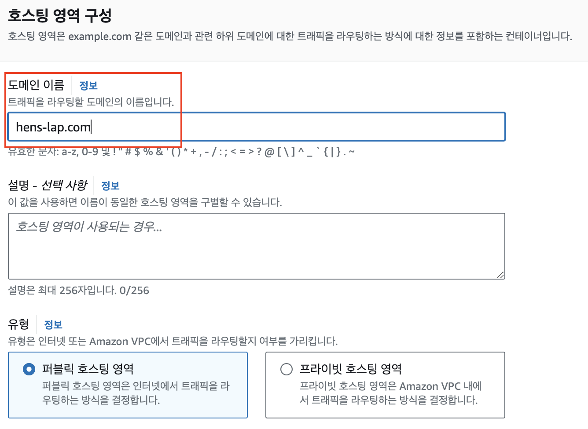
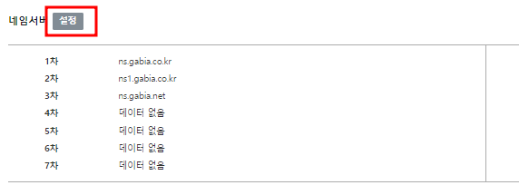
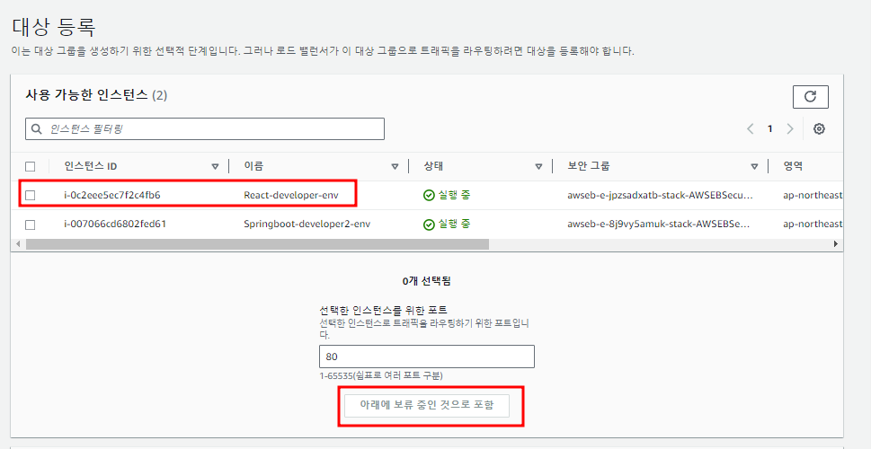
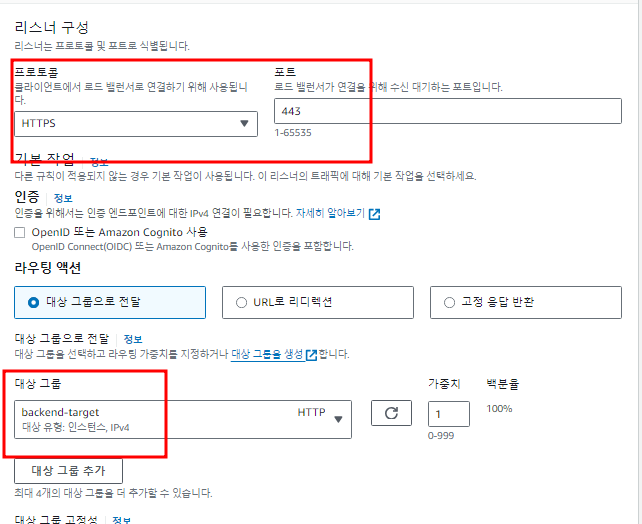
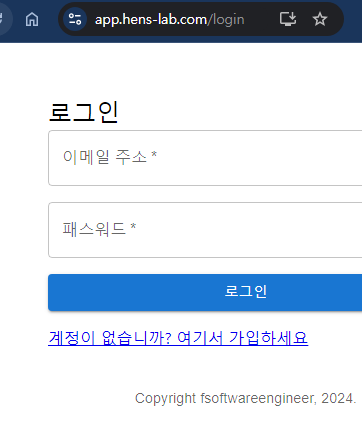

## Route53 도메인 설정
- 인증과 인가를 구현할 때, JWT는 반드시 HTTPS와 사용해야 한다고 했다.
- HTTPS 인증서를 받기 위해 필요한 절차를 학습해보자.

### 도메인 구매
- AWS콘솔에서 Route53으로 들어간다.
- 도메인과 호스팅 관리를 도와주는 서비스이다.


- 대시보드의 도메인 등록을 선택하고 시작하기를 누른다.


- 사용하고 싶은 도메인을기입한 후 검색을 누른다.
- 아래 사용하고 싶은 도메인을 선택하고 결제를 진행합니다.
- 본인의 연락처를 기입한 후 계속을 누른다.
- 다음으로 넘어가 연락처 정보를 확인한 후 결제한다.
- 도메인 이름에 따라 가격이 달라질 수 있음을 유의하자
- 도메인을 구매하면 입력한 이메일로 확인 메일이 전송된다.
- 확인 이메일의 링크를 눌러야 도메인이 활성화되니 반드시 활성화 링크를 누르자.

### 다른 사이트를 통한 구매
- https://www.gabia.com 에서도 원하는 도메인을 검색하고 구매할 수 있다.


- 원하는 도메인을 선택하고 신청하기를 누릅니다.


- 전화번호와 주소만 입력한 후 결제하기로 넘어갑니다.


### 호스팅 영역 생성
- 도메인을 생성했으면 이 도메인을 위한 호스팅 영역을 생성한다.
- 호스팅 영역에서는 서브 도메인을 생성한다.
- Route 53의 왼쪽 탭에서 호스팅 영역을 누른다.



- 이전에 산 도메인 이름을 기입하고 호스팅 생성영역을 누른다.
- 생성된 호스트 영역으로 들어가면 두 개의 기본 레코드가 추가돼있다.


### Host Zone(호스트 영역)
- 호스트 영역은 DNS영역파일이다.
- DNS영역을 생성하는 이유는 여러 개의 레코드를 한 곳에서 관리하기 위함이다.

### 레코드(Record)
- 레코드는 쉽게 말하면 이름과 IP를 연결해 놓은 파일 또는 엔트리이다.
- 레모드에는 종류가 여러 개 있는데 호스트 영역을 생성하면 일단 SOA와 NS가 하나씩 생긴다.
#### SOA(Start Of Authority)레코드
- 이 영역을 관리하는 관리자의 정보를 가지고 있는 레코드

#### NS(Name Server)레코드
- 해당 도메인의 IP를 물어볼 서버들을 가지고 있다.

### A레코드
- 해당 도메인을 특정 IP 또는 다른 도메인으로 연결하는 레코드이다.

### 가비아 네임서버 설정하기
- 가비아에 로그인 한 후 My가비아탭으로 이동합니다.
- 가운데 도메인을 눌러 이동합니다.


- 구매한 도메인의 관리버튼을 누릅니다.


- 네임서버의 설정 버튼을 누릅니다.



- route 53에서 등록한 레코드에서 만들어진 트래픽 라우터 대상을 4개 모두 복사한다.


- 가비아에서 네임서버 설정부분에 차례대로 넣되 마지막 .은 빼고 넣어야 한다.


- 모두 적은 뒤 적용 버튼을 누른다.

### 서브 도메인 만들기
- A레코드를 이용하여 백엔드와 프론트엔드에 서브 도메인을 만들어 연결해주자
- route 53 > 내가 만든 호스팅 영역으로 이동한다.
- 오른쪽 위 레코드 생성 버튼을 누른다.
- 서브도메인 앞에 붙이기 위한 레코드 이름을 설정합니다.
    - 여기서는 예시로 다음과 같이 작성합니다.(꼭 똑같이 작성해야 하는건 아니다.)
    - 프론트엔드에 app.자기도메인
    - 백엔드에서는 api.자기도메인


#### 값 설정하기
- 레코드를 생성할 때 값에는 로드밸런서나 IP주소를 넣어줘야 한다.
- EC2 > 인스턴스로 이동해 인스턴스ID를 클릭한다.
- IPv4 주소를 복사해 붙혀넣자


```
이렇게 프론트엔드와 백엔드를 연결하는 두 개의 서브 도메인을 만든다.
하지만 연결이 되고 적용되기 까지 24 ~ 48시간이 걸릴 수 있다.
```


### 백엔드에 요청하는 코드 수정하기
- React에서 스프링부트에 요청하는 주소를 우리가 연결한 서브 도메인 주소로 바꾸자.
- 주소가 담겨있는 api-config.js를 수정하가
```js
let backendHost;

const hostname = window && window.location && window.location.hostname;

if (hostname === "localhost") {
  backendHost = "http://localhost:8080";
} else {
  backendHost = "http://api.<설정한도메인>";
}

export const API_BASE_URL = `${backendHost}`; 
```
- npm run build를 하여 eb에 다시 배포를 진행합니다.

### CORS 문제 수정하기
- WebSecurityConfig클래스에 프론트에서 들어오는 요청 허가하기

```java
configuration.setAllowedOrigins(Arrays.asList(
          "http://localhost:3000",
    		  "http://app.hens-lab.com",
    		  "https://app.hens-lab.com"));
```
- 브라우저에 http://app.본인도메인을 입력하면 접속할 수 있다.


## 로드밸런서 설정하기
### 로드밸런서란?
- 서버에 대한 네트워크 트래픽을 효율적으로 분산시켜 여러 서버로 나누어 처리하는 장치 또는 소프트웨어다.
- 로드밸런서를 사용하면 트래픽 부하를 분산시켜 각 서버에 가해지는 부담을 줄이고, 서버가 과부하로 인해 다운되는 것을 방지하여 애플리케이션의 성능과 가용성을 높일 수 있다.
### AWS Elastic Load Balancer(ELB)
- AWS에서 제공하는 로드밸런싱 서비스로, EC2 인스턴스 간 트래픽을 자동으로 분산시킨다.
- AWS ELB는 여러 유형의 로드밸런서를 제공한다.
#### ELB의 종류
- Application Load Balancer(ALB) : L7 로드밸런서로, HTTP 및 HTTPS 트래픽을 처리하며, 애플리케이션 기반 라우팅을 지원한다.
- Network Load Balancer(LAB) : L4 로드밸런서로, TCP 트래픽을 처리하며 대량의 트래픽을 빠르게 분산할 수 있다.
- Classic Load Balancer (CLB): L4 및 L7 로드밸런싱 기능을 제공하지만, 새로운 기능 지원이 제한된다.
```
※ OSI 7계층
- 네트워크 통신 과정을 7개의 계층으로 나눈 모델로, 컴퓨터 네트워크에서 통신이 이루어지는 방식과 각 단계의 역할을 명확히 하기 위해서 설계되었다.
- 각 계층은 독립적이면서도 상호 작용하며, 데이터가 한 계층에서 다른 계층으로 이동하면서 구체적인 통신 기능을 수행한다.
- 각 계층을 L1, L2, L3 이런 식으로 줄여서 부르기도 한다.
- L1: 물리 계층(Physical Layer) 물리적 매체를 통해 비트 전송
- L2: 데이터 링크 계층(Data Link Layer) 프레임 단위의 데이터 전송
- L3: 네트워크 계층(Network Layer) IP 주소 기반 경로 설정 및 라우팅
- L4: 전송 계층(Transport Layer) 신뢰성 있는 전송, 오류 검출, 포트 기반 통신
- L5: 세션 계층(Session Layer) 세션 관리, 대화 제어, 데이터 동기화
- L6: 프레젠테이션 계층(Presentation Layer) 데이터 암호화/복호화, 데이터 형식 변환
- L7: 응용 계층(Application Layer) 사용자와 네트워크 간 인터페이스 제공
```
### Target Group
- 로드밸런서가 트래픽을 분산시킬 대상을 정의하는 그룹이다.
- 로드밸런서에 연결된 인스턴스, 컨테이너, IP 주소 등의 리소스를 그룹으로 묶어 관리하며, 이를 통해 로드밸런서는 트래픽을 효율적으로 분배할 수 있다.

### Target
- 로드밸런서가 트래픽을 보내는 대상이다.
- AWS에서는 여러 종류의 리소스를 타겟으로 사용할 수 있다.
- EC2 인스턴스, Lambda 함수, 컨테이너, IP 주소 등이 타겟이 될 수 있다.

### 타겟그룹 만들기
- [EC2]로 이동하여 왼쪽 아래 [대상그룹]을 클릭한다.


- 대상 유형 선택은 [인스턴스]를 선택한다.
- 대상 그룹 이름을 작성하고 다음으로 넘어간다.


- 라우팅 하려고 하는 인스턴스를 선택한 후 포트를 설정하고 아래에 보류 중인 것으로 포함을 누른다.



- 대상그룹 생성을 누른다.

### Health Check
- Target Group은 각 타겟의 상태를 모니터링할 수 있는 헬스 체크 기능을 제공한다.
- 헬스 체크를 통해 타겟이 정상인지 여부를 판단하고, 트래픽을 정상적인 타겟에만 전달한다.
- 헬스 체크는 주로 HTTP(S) 요청을 통해 진행되며, 설정된 기준에 따라 헬스 체크에 통과하지 못한 타겟은 트래픽 분배에서 제외된다.


### 2. 인스턴스에 요청이 들어오도록 설정
- EC2 > 보안그룹 > 타겟의 보안그룹 ID로 이동한다.
- 인바운드 규칙 편집을 누른다.
- HTTP와 HTTPS에 대한 인바운드 규칙을 추가해준다.
- 소스는 Anywhere-Ipv4로 한다.
- 그리고 규칙 저장을 누른다.


#### 인바운드 규칙
- 네트워크 보안에서 특정 인프라나 시스템으로 들어오는 트래픽을 제어하는 규칙을 말한다.
- 주로 방화벽이나 보안 그룹 설정에서 사용되며, 허용 또는 차단할 트래픽을 정의하는데 활용한다.
- AWS EC2 인스턴스나 네트워크 장비에서 인바운드 규칙을 설정할 때 고려하는 항목
  - 소스(Source) : 어떤 IP 주소 또는 IP 범위에서 오는 트래픽을 허용할지 결정한다.
  - 프로토콜(Protocol) : 허용할 트래픽의 프로토콜을 설정한다. 일반적으로 많이 사용하는 프로토콜로는 TCP, UDP, ICMP등이 있다.
  - 포트(Port) : 특정 애플리케이션이 사용하는 포트를 지정하여 해당 포트로 접근하는 트래픽을 허용하거나 차단할 수 있다. HTTP는 80, HTTPS는 433을 사용한다.


### 3. 로드밸런서 생성하기
- [EC2]의 왼쪽 아래 [로드밸런서]탭으로 이동한다.
- 오른쪽 위에 로드 밸런서 생성 버튼을 누른다.


- Application Load Balancer를 생성한다.


- 로드밸런서의 이름을 설정한다.
- 본인이 알아보기 쉽게 정하면 된다
- 예시
  - frontend-lb
  - backend-lb


- VPC는 기본값을 사용한다.
- 가용영역은 인스턴스가 만들어진 영역을 보고 고르면 된다.
- 2개를 고르라고 하기 때문에 2개를 골라준다.


- 리스너 및 라우팅
- 타겟으로 80번 포트로 전달할 것이다.


- 로드밸런서 생성 버튼을 누른다.

### 도메인에 로드밸런서를 연결한다.
- [Route53] > 호스팅영역으로 가서 본인이 설정한 도메인으로 들어간다.
- A레코드를 누르고 레코드 편집을 누른다.
- 별칭을 활성화 하고 엔드포인트에 [Application/Classic Load Balancer]에 대한 별칭을 선택한다.
- 리전은 로드밸런서를 만든 리전을 선택한다.
- 우리가 만든 로드밸런서를 선택한다.


## HTTPS사용하기

### HTTPS
- HTTP에 SSL(Secure Sockets Layer)를 추가한 프로토콜로, 데이터를 암호화하여 안전하게 통신을 할 수 있도록 만든다.
- HTTPS를 사용하려면 서버가 SSL/TLS 인증서를 설치해야 한다.
- 인증서는 신뢰할 수 있는 인증 기관(CA, Certificate Authority)이 발급하며, 해당 서버가 실제로 그 주체가 맞는지 증명해준다.
- 인증서를 통해 클라이언트는 서버가 신뢰할 수 있는 대상인지 확인한 후 통신을 시작할 수 있다.

### SSL
- HTTPS에서 보안을 제공하는 초기 기술로, 웹 서버와 브라우저 간의 통신을 암호화한다.

### 리액트 api-config.js 수정하기
```js
let backendHost;

const hostname = window && window.location && window.location.hostname;

if(hostname === "localhost"){
    backendHost = "http://localhost:5000";
}else {
    backendHost = "https://api.hens-lab.com";
  }

export const API_BASE_URL = `${backendHost}`
```

### 백엔드/프론트엔드 AWS Certificate Manager를 이용한 https설정
- 콘솔에 certificate manager를 입력하고 이동한다.
- 인증서 요청 버튼을 누른다.


- 퍼블릭 인증서 요청을 통해 요청을 시도한다.


- 도메인 이름에 가비아에서 구매한 도메인을 입력해준다.
- 프론트와 백엔드에 할당한 서브 도메인에 모두 적용을 시켜주기위해 [*.도메인] 형식으로 적는다.
- 나머지는 수정할 것이 없고 요청 버튼을 누른다.


- 검증 대기중 / 아니요/ 부적격이 뜨면 정상이다.


### 백엔드 애플리케이션 HTTPS 설정
- [EC2] > [로드밸런서]로 이동하여 백엔드에서 사용하는 로드밸런서를 클릭하고 리스너 추가를 누른다.
  


- 프로토콜 : https
- 포트 : 443
- 대상그룹 : 본인의 백엔드 타겟
- 추가를 누릅니다.



### 프론트엔드 애플리케이션 HTTPS 설정
- [EC2] > [로드밸런서]로 이동하여 프론트엔드에서 사용하는 로드밸런서를 클릭하고 리스너 추가를 누른다.

- 프로토콜 : https
- 포트 : 443
- 대상그룹 : 본인의 프론트엔드 타겟
- 추가를 누릅니다.

### VPC의 보안그룹 설정하기
- 로드밸런서에 443포트가 접속할수 있도록 하자
- [EC2] >[보안그룹]으로 들어가 VPC보안그룹 ID를 누른다.


- 인바운드 규칙 편집을 누르고 HTTPS를 추가해준다.
- 규칙저장을 한다.


### 브라우저에서 확인하기
- 브라우저에 https://app.도메인 을 입력하고 잘 출력되는지 확인해보자.

