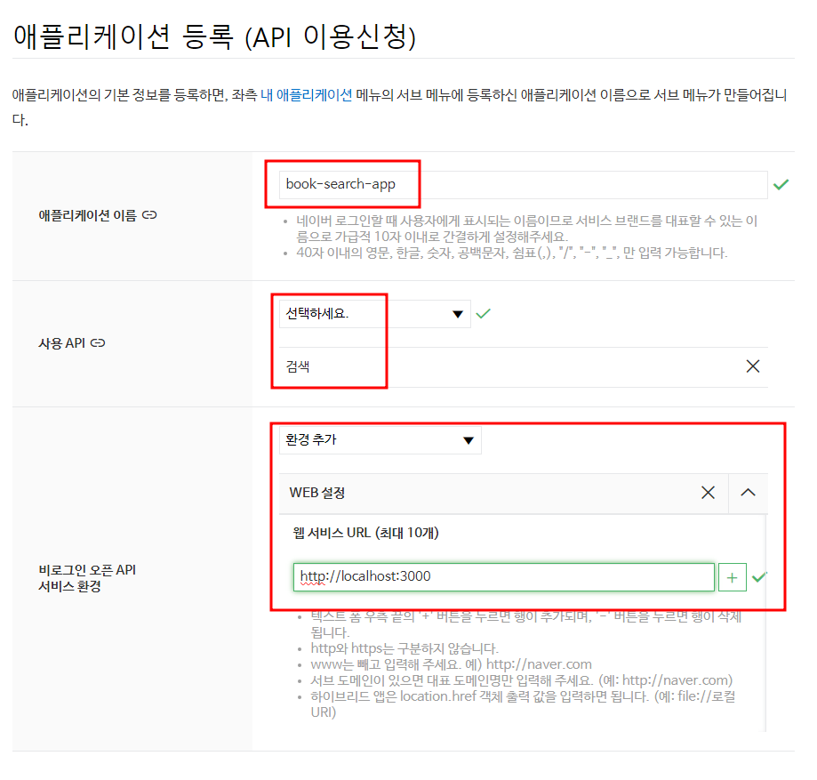
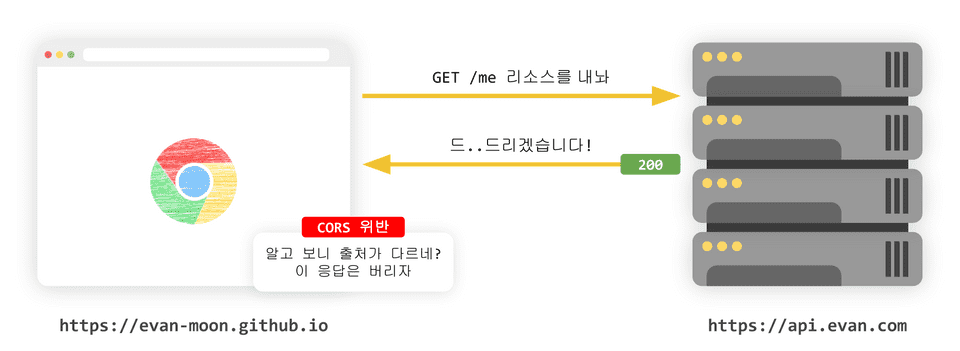
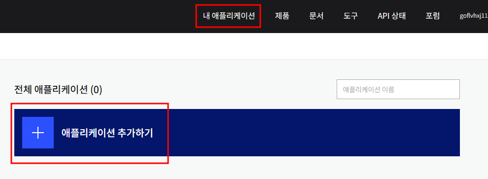
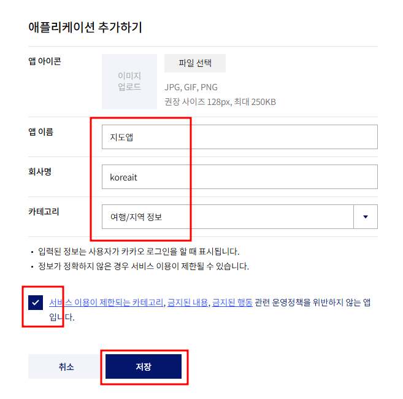
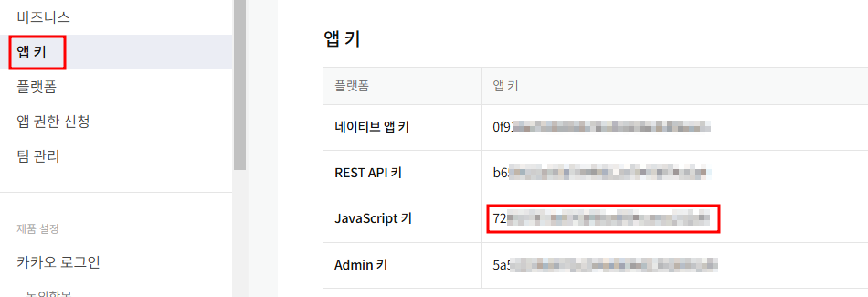
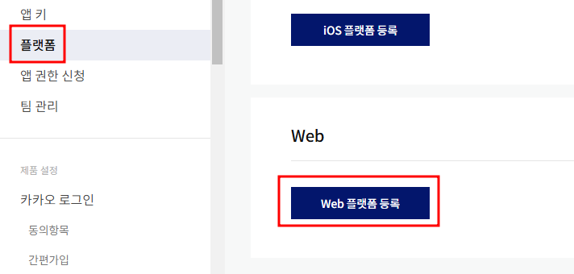
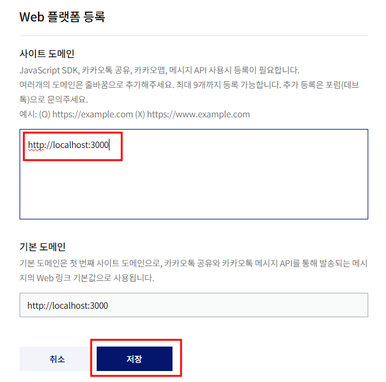
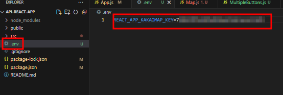
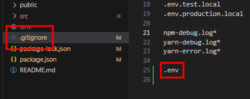
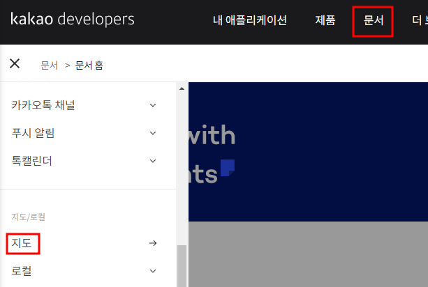

# 외부 api 사용해보기
- 다양한 종류의 api를 사용해보자.
- api-react-app 만들기
- react-router-dom 설치하기
- src에 api 폴더 만들기

## App.js에 코드 작성하기
```js
import './App.css';
import { Routes, Route, BrowserRouter } from 'react-router-dom';
import Address from './api/Address'
import MultipleButtons from './MultipleButtons';

function App() {
  
  return (
    <div className='App'>
      <BrowserRouter>
        <Routes>
          <Route path="/" element={<MultipleButtons />} />
          <Route path="/address" element={<Address />} />
          <Route path="/about" element={<MultipleButtons />} />
          <Route path="/address" element={<MultipleButtons />} />
        </Routes>
      </BrowserRouter>
    </div>
  );
}
export default App;
```

## MultiButtons.js파일 만들기
```js
import { useNavigate } from 'react-router-dom';

function MultipleButtons() {
  const navigate = useNavigate();

  // 하나의 핸들러에서 버튼 구분하기
  const handleButtonClick = (event) => {
    const buttonId = event.target.id; // 버튼의 id 값으로 구분

    switch (buttonId) {
      case 'address':
        navigate('/address');
        break;
      case 'about':
        navigate('/about'); // about 페이지로 이동
        break;
      case 'contact':
        navigate('/contact'); // contact 페이지로 이동
        break;
      default:
        console.log('알 수 없는 버튼 클릭');
    }
  };

  return (
    <div>
      <button id="address" onClick={handleButtonClick}>
        주소찾기 api
      </button>
      <button id="about" onClick={handleButtonClick}>
        About
      </button>
      <button id="contact" onClick={handleButtonClick}>
        Contact
      </button>
    </div>
  );
}

export default MultipleButtons;
```

## 1. 주소 api 사용하기
### 공식 DAUM 주소 API 사용설명서
- https://postcode.map.daum.net/guide

### DAUM 주소 API 활용 특징
- API 키를 발급받을 필요가 없다.
- 사용량에 대한 제한이 없다.
- 기업용이든 상업적 용도이든 상관없이 무료로 사용 가능하다.
- 기초구역번호가 발급된 도로명 주소, 영문 주소를 확인할 수 있다.
- 행정안전부에서 제공하는 "도로명 주소"DB를 직업 업데이트 받고 있으므로 가장 최신의 데이터를 이용할 수 있다.

### 공식문서 사용 예시
```JS
<script src="//t1.daumcdn.net/mapjsapi/bundle/postcode/prod/postcode.v2.js"></script>
<script>
    new daum.Postcode({
        oncomplete: function(data) {
            // 팝업에서 검색결과 항목을 클릭했을때 실행할 코드를 작성하는 부분입니다.
            // 예제를 참고하여 다양한 활용법을 확인해 보세요.
        }
    }).open();
</script>
```

### 패키지 설치하기
- 우리는 REACT에서 사용을 할 것이므로 패키지를 설치한다.
- Daum 우편번호 검색 서비스를 React 환경에서 간편하게 이용할 수 있습니다.
```JS
npm install react-daum-postcode
```
※ 주의사항
- react-daum-postcode는 Daum 우편번호 서비스와 독립적으로 제작된 패키지다.

### 주요 속성
### oncomplete
- 우편번호 검색 결과 목록에서 특정 항목을 클릭한 경우, 해당 정보를 받아서 처리할 콜백 함수를 정의하는 부분이다.
- null값 또는 정의하지 않을 시에 검색은 가능하지만, 결과 항목을 클릭하면 아무 일도 일어나지 않는다.

```js
 oncomplete: function(data) {
        //data는 사용자가 선택한 주소 정보를 담고 있는 객체이며, 상세 설명은 아래 목록에서 확인하실 수 있습니다.
    }
```

#### 항목
| 항목                      | 설명                                                                                                                                                                                      |
| ------------------------- | ----------------------------------------------------------------------------------------------------------------------------------------------------------------------------------------- |
| `zonecode`                | 국가기초구역번호. 2015년 8월 1일부터 시행될 새 우편번호.                                                                                                                                  |
| `address`                 | 기본 주소 (검색 결과에서 첫줄에 나오는 주소, 검색어의 타입(지번/도로명)에 따라 달라진다.)                                                                                                 |
| `addressEnglish`          | 기본 영문 주소                                                                                                                                                                            |
| `addressType`             | 검색된 기본 주소 타입: R(도로명), J(지번)                                                                                                                                                 |
| `userSelectedType`        | 검색 결과에서 사용자가 선택한 주소의 타입                                                                                                                                                 |
| `noSelected`              | 연관 주소에서 "선택 안함" 부분을 선택했을때를 구분할 수 있는 상태변수                                                                                                                     |
| `userLanguageType`        | 검색 결과에서 사용자가 선택한 주소의 언어 타입: K(한글주소), E(영문주소)                                                                                                                  |
| `roadAddress`             | 영문 도로명 주소                                                                                                                                                                          |
| `jibunAddress`            | 지번 주소                                                                                                                                                                                 |
| `jibunAddressEnglish`     | 영문 지번 주소                                                                                                                                                                            |
| `autoRoadAddress`         | '지번주소'에 매핑된 '도로명주소'가 여러개인 경우, 사용자가 '선택안함' 또는 '지번주소'를 클릭했을 때 연관된 도로명 주소 중 임의로 첫번째 매핑 주소를 넣어서 반환합니다.                    |
| `autoRoadAddressEnglish`  | autoRoadAddress의 영문 도로명 주소                                                                                                                                                        |
| `autoJibunAddress`        | '도로명주소'에 매핑된 '지번주소'가 여러 개인 경우, 사용자가 '선택안함' 또는 '도로명주소'를 클릭했을 때 첫 번째 매핑 주소가 반환됨. (autoMapping을 false로 설정한 경우 값이 채워지지 않음) |
| `autoJibunAddressEnglish` | `autoJibunAddress`의 영문 지번 주소                                                                                                                                                       |
| `buildingCode`            | 건물관리번호                                                                                                                                                                              |
| `buildingName`            | 건물명                                                                                                                                                                                    |
| `apartment`               | 공동주택 여부 (아파트, 연립주택, 다세대주택 등)                                                                                                                                           |
| `sido`                    | 도/시 이름                                                                                                                                                                                |
| `sidoEnglish`             | 도/시 이름의 영문                                                                                                                                                                         |
| `sigungu`                 | 시/군/구 이름                                                                                                                                                                             |
| `sigunguEnglish`          | 시/군/구 이름의 영문                                                                                                                                                                      |
| `sigunguCode`             | 시/군/구 코드 (5자리 구성된 시/군/구 코드)                                                                                                                                                |
| `roadnameCode`            | 도로명 코드, 7자리로 구성된 도로명 코드. 추후 7자리 이상으로 늘어날 수 있음.                                                                                                              |
| `bcode`                   | 법정동/법정리 코드                                                                                                                                                                        |
| `roadname`                | 도로명 값, 검색 결과 중 선택한 도로명주소의 "도로명" 값이 들어감 (건물번호 제외)                                                                                                          |
| `roadnameEnglish`         | 도로명 값, 검색 결과 중 선택한 도로명의 "영문" 값이 들어감 (건물번호 제외)                                                                                                                |
| `bname`                   | 법정동/법정리 이름                                                                                                                                                                        |
| `bnameEnglish`            | 법정동/법정리 이름의 영문                                                                                                                                                                 |
| `bname1`                  | 법정리의 읍/면 이름 ("동" 지역일 경우에는 공백, "리" 지역일 경우에는 "읍" 또는 "면" 정보가 들어감)                                                                                        |
| `bname1English`           | 법정리의 읍/면 이름의 영문 ("동" 지역일 경우에는 공백, "리" 지역일 경우에는 "읍" 또는 "면" 정보가 들어감)                                                                                 |
| `bname2`                  | 법정동/법정리 이름                                                                                                                                                                        |
| `bname2English`           | 법정동/법정리 이름의 영문                                                                                                                                                                 |
| `hname`                   | 행정동 이름, 검색어를 행정동으로 검색하고, 검색결과의 법정동과 검색어에 입력한 행정동이 다른 경우에 표시됨.                                                                               |
| `query`                   | 사용자가 입력한 검색어                                                                                                                                                                    |
| `postcode`                | 구 우편번호 (2020년 3월 9일 이후로는 데이터가 내려가지 않음)                                                                                                                              |
| `postcode1`               | 구 우편번호 앞 3자리 (2020년 3월 9일 이후로는 데이터가 내려가지 않음)                                                                                                                     |
| `postcode2`               | 구 우편번호 뒤 3자리 (2020년 3월 9일 이후로는 데이터가 내려가지 않음)                                                                                                                     |
| `postcodeSeq`             | 구 우편번호 일련번호 (2020년 3월 9일 이후로는 데이터가 내려가지 않음)                                                                                                                     |

### onclose
- 우편번호 찾기 화면을 팝업으로 띄운 후, 검색 결과를 선택하거나, 브라우저의 닫기버튼을 통해 닫았을 때 발생하는 콜백 함수를 정의하는 부분이다.
- 검색결과를 선택한 경우에는 onComplete콜백함수가 완료된 후에 실행되게 된다.

```js
    onclose: function(state) {
        //state는 우편번호 찾기 화면이 어떻게 닫혔는지에 대한 상태 변수 이며, 상세 설명은 아래 목록에서 확인하실 수 있습니다.
        if(state === 'FORCE_CLOSE'){
            //사용자가 브라우저 닫기 버튼을 통해 팝업창을 닫았을 경우, 실행될 코드를 작성하는 부분입니다.

        } else if(state === 'COMPLETE_CLOSE'){
            //사용자가 검색결과를 선택하여 팝업창이 닫혔을 경우, 실행될 코드를 작성하는 부분입니다.
            //oncomplete 콜백 함수가 실행 완료된 후에 실행됩니다.
        }
    }
```

#### 항목
<table border="1">
  <tr>
    <th>항목</th>
    <th>값</th>
    <th>설명</th>
  </tr>
  <tr>
    <td rowspan="2">state</td>
    <td>FORCE_CLOSE</td>
    <td>브라우저의 닫기 버튼을 통해 화면이 닫혔을 경우 (레이어 모드에서는 발생하지 않음).</td>
  </tr>
  <tr>
    <td>COMPLETE_CLOSE</td>
    <td>검색결과를 선택하여 화면이 닫혔을 경우 (팝업/레이어 모드의 기본 동작).</td>
  </tr>
</table>


### AddressFinder.js 만들기
```js
import React, { useState, useEffect } from 'react';
import {useDaumPostcodePopup} from 'react-daum-postcode';
import '../address.css'

const PostcodeComponent = () => {
  const [postcode, setPostcode] = useState(''); // 우편번호를 저장할 state
  const [address, setAddress] = useState(''); // 주소를 저장할 state
  const [detailAddress, setDetailAddress] = useState(''); // 상세주소를 저장할 state
  const [extraAddress, setExtraAddress] = useState(''); // 참고항목을 저장할 state

    // Daum 우편번호 API 스크립트 URL
    let scriptUrl = 'https://t1.daumcdn.net/mapjsapi/bundle/postcode/prod/postcode.v2.js'

    // react-daum-postcode의 useDaumPostcodePopup 훅을 사용하여 API를 팝업으로 실행할 준비
    const open = useDaumPostcodePopup(scriptUrl);

  
    // Daum Postcode API에서 주소 선택 완료 후 실행되는 함수
    const handleComplete = (data) => {
        let addr = ''; // 주소 변수
        let extraAddr = ''; // 참고항목 변수

        // 사용자가 선택한 주소 타입에 따라 주소 설정
        // 도로명 주소(R) 또는 지번 주소(J)를 선택했는지 확인

        if (data.userSelectedType === 'R') {
            addr = data.roadAddress; // 도로명 주소 선택 시 도로명 주소 할당
        } else {
            addr = data.jibunAddress; // 지번 주소 선택 시 지번 주소 할당
        }

        // 참고항목 처리 (도로명 주소인 경우)
        if (data.userSelectedType === 'R') {
            // 법정동명이 있는지 확인하고 추가 (법정동, 법정리가 있을 때만)
            if (data.bname !== '' && /[동|로|가]$/g.test(data.bname)) {
            extraAddr += data.bname;
            }
            // 건물명이 있고 공동주택일 경우 추가
            if (data.buildingName !== '' && data.apartment === 'Y') {
            extraAddr += extraAddr !== '' ? ', ' + data.buildingName : data.buildingName;
            }
            // 참고항목이 있다면 괄호로 감싸서 추가
            if (extraAddr !== '') {
            extraAddr = ` (${extraAddr})`;
            }
            // 참고항목 state 업데이트
            setExtraAddress(extraAddr);
        } else {
            // 지번 주소인 경우 참고항목을 빈 문자열로 설정
            setExtraAddress('');
        }

        setPostcode(data.zonecode); // 우편번호 설정
        setAddress(addr);// 주소 설정

        // 상세주소 입력 필드로 포커스를 이동
        document.getElementById('sample6_detailAddress').focus();
        }

        // 팝업을 열고 완료 시 handleComplete 함수 실행
        const handleClick = () => {
        open({ onComplete: handleComplete });
        };

  return (
    <div className="form-group">
    <div className="form-row">
      <input
        type="text"
        id="sample6_postcode"
        placeholder="우편번호"
        value={postcode}
        readOnly
      />
      <input
        type="button"
        onClick={handleClick}
        value="우편번호 찾기"
      />
      </div>
      <input
        type="text"
        id="sample6_address"
        placeholder="주소"
        value={address}
        readOnly
      />
      <div className="form-row split">
      <input
        type="text"
        id="sample6_detailAddress"
        placeholder="상세주소"
        value={detailAddress}
        onChange={(e) => setDetailAddress(e.target.value)}
      />
      <input
        type="text"
        id="sample6_extraAddress"
        placeholder="참고항목"
        value={extraAddress}
        readOnly
      />
    </div>
    </div>
  );
};

export default PostcodeComponent;
```

## 2. 네이버 검색 api
- 네이버 개발자 센터로 이동한다.
- 다양한 api를 제공하는데 도서를 검색하는 api를 사용해보자.


- API를 사용하기 위헤 어플리케이션을 등록한다.



- Client ID와 Client Secret을 발급받는다.
- 어딘가에 잘 복사해놓자.


### 요청 URL
|요청 URL|결과값 반환 형식|
|------|---------------------|
|https://openapi.naver.com/v1/search/book.xml|XML|
|https://openapi.naver.com/v1/search/book.json|JSON|

### 프로토콜
- HTTPS

### HTTP메서드
- GET

### 파라미터
- 파라미터를 쿼리스트링 형식으로 전달한다.

<table border="1" cellspacing="0" cellpadding="10">
  <tr>
    <th>파라미터</th>
    <th>타입</th>
    <th>필수 여부</th>
    <th>설명</th>
  </tr>
  <tr>
    <td>query</td>
    <td>String</td>
    <td>Y</td>
    <td>검색어. UTF-8로 인코딩되어야 합니다.</td>
  </tr>
  <tr>
    <td>display</td>
    <td>Integer</td>
    <td>N</td>
    <td>한 번에 표시할 검색 결과 개수 (기본값: 10, 최댓값: 100)</td>
  </tr>
  <tr>
    <td>start</td>
    <td>Integer</td>
    <td>N</td>
    <td>검색 시작 위치 (기본값: 1, 최댓값: 1000)</td>
  </tr>
  <tr>
    <td rowspan="2">sort</td>
    <td rowspan="2">String</td>
    <td rowspan="2">N</td>
    <td>- sim: 정확도순으로 내림차순 정렬 (기본값)</td>
  </tr>
  <tr>
    <td>- date: 출간일순으로 내림차순 정렬</td>
  </tr>
</table>

### 참고사항
- API를 요청할 때 다음 예와 같이 HTTP 요청 헤더에 클라이언트 아이디와 클라이언트 시크릿을 추가해야 한다.
```
GET /v1/search/book.xml?query=%EC%A3%BC%EC%8B%9D&display=10&start=1 HTTP/1.1
Host: openapi.naver.com
User-Agent: curl/7.49.1
Accept: */*
X-Naver-Client-Id: {애플리케이션 등록 시 발급받은 클라이언트 아이디 값}
X-Naver-Client-Secret: {애플리케이션 등록 시 발급받은 클라이언트 시크릿 값}
```

### 응답
- 응답에 성공하면 XML 또는 JSON 형식으로 반환한다.

| 항목                   | 타입     | 설명                                                   |
|------------------------|----------|--------------------------------------------------------|
| `lastBuildDate` | dateTime | 검색 결과를 생성한 시간                                   |
| `total`        | Integer  | 총 검색 결과 개수                                        |
| `start`        | Integer  | 검색 시작 위치                                           |
| `display`      | Integer  | 한 번에 표시할 검색 결과 개수                             |
| `title`   | String   | 책 제목                                                  |
| `link`    | String   | 네이버 도서 정보 URL                                      |
| `image`   | String   | 섬네일 이미지의 URL                                       |
| `author`  | String   | 저자 이름                                                |
| `discount`| Integer  | 판매 가격. 절판 등의 이유로 가격이 없으면 값을 반환하지 않음  |
| `publisher`| String  | 출판사                                                   |
| `isbn`    | Integer  | ISBN                                                    |
| `description`| String| 네이버 도서의 책 소개                                    |
| `pubdate` | dateTime | 출간일     

### BookSearch.js 만들기
```js
import React, {useState} from 'react'
import axios from 'axios';
function BookSearch(){
    const [query, setQuery] = useState(''); // 검색어
    const [books, setBooks] = useState([]); // 검색 결과로 얻은 책 목록
    const [loading, setLoading] = useState(false); // 로딩 상태
    const [error, setError] = useState(null); // 에러 상태
  
    // 네이버 도서 API 호출 함수
    const searchBooks = async () => {
      setLoading(true);
      setError(null);
      
      const clientId = 'bFq0Fj2phTIER882qECQ'; // 네이버에서 발급받은 Client ID
      const clientSecret = 'mOnwlkBvEBT'; // 네이버에서 발급받은 Client Secret
      
      try {
        const response = await axios.get(`/naver-api/v1/search/book.json`, {
          params: {
            query: query,  // 검색어
          },
          headers: {
            'X-Naver-Client-Id': clientId,
            'X-Naver-Client-Secret': clientSecret,
          },
        });
  
        // 검색 결과를 books 상태에 저장
        setBooks(response.data.items);
      } catch (err) {
        setError('도서 검색에 실패했습니다.');
      } finally {
        setLoading(false);
      }
    };
  
    // 검색 버튼 클릭 시 호출
    const handleSearch = (e) => {
      e.preventDefault();
      searchBooks();
    };
  
    return (
      <div>
        <h1>네이버 도서 검색</h1>
        <form onSubmit={handleSearch}>
          <input
            type="text"
            value={query}
            onChange={(e) => setQuery(e.target.value)} // 입력 값이 변경되면 query 상태 업데이트
            placeholder="책 이름을 입력하세요"
          />
          <button type="submit">검색</button>
        </form>
  
        {loading && <p>검색 중...</p>}
        {error && <p>{error}</p>}
  
        <ul>
          {books.map((book) => (
            <li key={book.isbn}>
              
              <p>제목: {book.title}</p>
              <p>저자: {book.author}</p>
              <p>출판사: {book.publisher}</p>
              <p>가격: {book.discount ? `${book.discount}원` : '가격 정보 없음'}</p>
              <a href={book.link} target="_blank" rel="noopener noreferrer">더보기</a>
            </li>
          ))}
        </ul>
      </div>
    );
}

export default BookSearch
```
- 실행해보면 CORS에러가 발생한 것을 볼 수 있다.
- 우리의 백엔드가 아닌데 CORS를 어떻게 처리할 수 있을까??

## CORS의 동작원리
### Simple requests인 경우
```
※ Simple Request란?
- HTTP메서드가 GET,HEAD,POST이다.
- 설정할 수 있는 헤더들(Accept, Accept-Language, Content-Language)만 변경한다.
- Contet-Type이(application/x-www-form-urlencoded, multipart/form-data, text/plain)인 경우
```
1. 서버로 요청을 한다.
2. 서버의 응답이 왔을 때 브라우저가 요청한 Origin과 응답한 헤더 Access-Control-Request-Headers의 값을 비교하여 유효한 요청이라면 리소스를 응답한다.
3. 만약 유효하지 않은 요청이라면 브라우저에서 이를 막고 에러가 발생한다.



- 출처를 비교하는 로직이 서버에 구현된 스펠이 아니라 브라우저에 구현된 스펙이라는 것이다.
- 서버는 CORS를 위반하더라도 정상적으로 응답을 해주고, 응답의 파기 여부는 브라우저가 결정한다.

### 근데 왜 포스트맨은 CORS에 안걸렸을까?
- 우선 브라우저를 쓰지 않으면 보내지 않는데, 앞서 말했듯이 origin이 다른지 판단하는 것은 브라우저 스펙이기 때문이다.
- 그래서 Postman과 같은 기능을 사용하면 json 형태든, POST로 보내든 CORS 문제가 발생하지 않는다.

## 서버에서 외부 API 요청하기
- 브라우저에서 응답을 받지 않으므로 브라우저를 거치지 않으면 된다.
- 즉 우리의 스프링부트 서버에서 네이버의 서버로 요청을 하면 브라우저를 거치는것이 아니기 때문에 CORS에 걸리지 않는다.

## 스프링부트 프로젝트 만들기
- spring-boot-starter-web만 추가하고 프로젝트를 만든다.

### WebClient
- Spring WebFlux에서 제공하는 비동기 HTTP 클라이언트로, RESTful 웹 서비스와의 통신을 비동기적으로 처리할 수 있는 강력한 도구다.
- Spring 5에서 도입되었으며, 기존의 동기 HTTP 클라이언트인 RestTemplate을 대체하는 용도로 설계되었다.
- 비동기 처리, 반응형 스트림, 그리고 다양한 HTTP 요청 메서드를 지원하는 것이 특징이다.

#### 의존성 추가
```groovy
// WebClient 사용을 위한 WebFlux 의존성
implementation 'org.springframework.boot:spring-boot-starter-webflux'
```

#### 주요 특징
`1. 비동기 및 반응형 프로그래밍 지원`
  - WebClient는 비동기적으로 HTTP 요청을 처리하고, 응답을 받아올 수 있다. 
  - 비동기 방식이므로, 서버로부터 응답을 기다리는 동안 다른 작업을 동시에 처리할 수 있다.
  - Mono나 Flux와 같은 Reactor 타입을 반환하며, 이를 통해 반응형 프로그래밍을 쉽게 적용할 수 있다.

`2. HTTP 요청 메서드 지원`
  - WebClient는 HTTP의 주요 메서드(GET, POST, PUT, DELETE, PATCH 등)를 모두 지원하며, 요청을 유연하게 구성할 수 있다.

`3. 유연한 요청 구성`
  - URI 경로, 쿼리 파라미터, 헤더, 쿠키, 요청 본문 등 다양한 옵션을 설정할 수 있다.
  - 각 요청마다 별도의 헤더를 추가하거나 인증 정보를 제공할 수 있으며, 필요에 따라 기본 설정을 미리 구성할 수도 있다.

`4. 비동기 처리와 예외 처리`
  - 비동기 처리뿐만 아니라 에러 발생 시 이를 처리하는 로직도 쉽게 추가할 수 있다. 
  - 비동기 스트림 처리와 함께 예외 처리 패턴을 결합해 안정적인 네트워크 통신을 구현할 수 있다.

`5. Blocking 요청 지원`
  - 비록 WebClient는 기본적으로 비동기 클라이언트이지만, 동기식으로 블로킹 방식의 요청도 처리할 수 있다. 필요한 경우 .block() 메서드를 사용해 동기적으로 응답을 받을 수 있다.

#### WebClient의 생성
- 기본 WebClient 생성
```java
WebClient webClient = WebClient.create();
```
- Builder를 사용하여 WebClient 구성
```java
WebClient webClient = WebClient.builder()
        .baseUrl("https://api.example.com")
        .defaultHeader(HttpHeaders.CONTENT_TYPE, MediaType.APPLICATION_JSON_VALUE)
        .build();
```

#### GET 요청
```java
WebClient webClient = WebClient.create("https://api.example.com");

Mono<String> response = webClient.get()
        .uri("/data")  // https://api.example.com/data
        .retrieve()    // 서버로부터 응답을 가져옴
        .bodyToMono(String.class);  // 응답 본문을 String으로 변환

response.subscribe(System.out::println);  // 비동기적으로 결과 출력
```

#### POST 요청
```java
WebClient webClient = WebClient.create("https://api.example.com");

Mono<String> response = webClient.post()
        .uri("/submit")
        .contentType(MediaType.APPLICATION_JSON)  // 요청 본문의 Content-Type 설정
        .bodyValue(new MyRequestBody("value1", "value2"))  // JSON 형식의 요청 본문
        .retrieve()
        .bodyToMono(String.class);

response.subscribe(System.out::println);
```

#### Mono와 Flux
- Mono와 Flux는 Spring WebFlux에서 사용하는 두 가지 주요 비동기 타입이며, Reactor 라이브러리의 핵심 개념이다.
- Reactive Streams의 일환으로, 비동기 데이터 스트림을 처리하는데 사용된다.

#### 1.Mono
- 0 또는 1개의 데이터만을 비동기적으로 반환하는 타입이다.
- 어떤 작업의 결과로 하나의 값 또는 빈 값(값이 없을 수도 있음)을 비동기적으로 처리할 때 사용한다. 
- 반적으로 비동기 작업에서 단일 값을 반환할 때 사용되며, null을 포함할 수도 있다.

#### 2.Flux
-  0개 이상의 데이터를 비동기적으로 처리할 수 있는 스트림을 나타낸다.
-  여러 개의 데이터를 연속적으로 방출하고 이를 처리할 때 사용한다.
-  무제한 스트림일 수도 있고, 유한한 스트림일 수도 있으며, 데이터 스트림을 지속적으로 생성하거나 이벤트 기반으로 처리하는데 사용된다.

### application.properties 설정
- 네이버 API의 클라이언트 ID와 시크릿을 설정파일에서 관리하는 것이 좋다.
```properties
naver.client.id=YOUR_CLIENT_ID
naver.client.secret=YOUR_CLIENT_SECRET
```

### NaverBookApiController 만들기
```java
import org.springframework.beans.factory.annotation.Value;
import org.springframework.http.HttpHeaders;
import org.springframework.http.MediaType;
import org.springframework.web.bind.annotation.GetMapping;
import org.springframework.web.bind.annotation.RequestParam;
import org.springframework.web.bind.annotation.RestController;
import org.springframework.web.reactive.function.client.WebClient;
import reactor.core.publisher.Mono;

@RestController
public class NaverBookApiController {

    // WebClient 객체를 사용하여 외부 API와 비동기 통신을 하기 위한 필드 선언
    private final WebClient webClient;

    // application.properties 또는 application.yml 파일에서 네이버 API 클라이언트 ID 값을 가져옴
    @Value("${naver.client.id}")
    private String clientId;

    // application.properties 또는 application.yml 파일에서 네이버 API 클라이언트 Secret 값을 가져옴
    @Value("${naver.client.secret}")
    private String clientSecret;

    // 생성자를 통해 WebClient.Builder를 주입받고 WebClient 객체를 초기화
    // 네이버 API의 기본 URL을 설정
    public NaverBookApiController(WebClient.Builder webClientBuilder) {
        this.webClient = webClientBuilder.baseUrl("https://openapi.naver.com/v1/search").build();
    }

    // 책 검색 요청을 처리하는 GET API 엔드포인트
    @GetMapping("/api/books")
    public Mono<String> searchBooks(@RequestParam String query) {
        // WebClient를 사용하여 네이버 책 검색 API에 GET 요청을 보냄
        return webClient.get()
                .uri(uriBuilder -> uriBuilder.path("/book.json")
                        // 검색어를 query 매개변수로 추가
                        .queryParam("query", query)
                        .build())
                // 요청 헤더에 Content-Type을 JSON으로 설정
                .header(HttpHeaders.CONTENT_TYPE, MediaType.APPLICATION_JSON_VALUE)
                // 네이버 API 인증을 위한 Client ID와 Secret을 헤더에 추가
                .header("X-Naver-Client-Id", clientId)
                .header("X-Naver-Client-Secret", clientSecret)
                // 요청을 서버로 보내고 응답을 받음
                .retrieve() // API 요청을 보내고 응답을 기다림
                // 응답의 Body를 Mono<String>으로 변환하여 비동기로 처리
                .bodyToMono(String.class); // 응답 데이터를 Mono 객체로 받음 (JSON 데이터를 문자열로 처리)
    }
}
```

### WebMvcConfig 만들기
- localhost:3000으로 응답이 잘 가도록 처리하자
```java
package com.korea.api.config;

import org.springframework.context.annotation.Configuration;
import org.springframework.web.servlet.config.annotation.CorsRegistry;
import org.springframework.web.servlet.config.annotation.WebMvcConfigurer;

//CORS
//하나의 출처에서 다른 출처로 REQUEST를 허용해주는것.
@Configuration
public class WebMvcConfig implements WebMvcConfigurer {

	@Override
	public void addCorsMappings(CorsRegistry registry) {
		registry.addMapping("/**")
		.allowedOrigins("http://localhost:3000")
		.allowedMethods("GET","POST","PUT","DELETE")
		.allowedHeaders("*")
		.allowCredentials(true)
		.maxAge(3600);
	}
}
```

### 리액트에서 우리의 서버에 요청하기
```js
import React, { useState } from 'react';
import axios from 'axios';

const NaverBookSearch = () => {
  const [query, setQuery] = useState(''); // 검색어 상태
  const [results, setResults] = useState([]); // 검색 결과 상태
  const [loading, setLoading] = useState(false); // 로딩 상태
  const [error, setError] = useState(null); // 에러 상태

  const handleSearch = async () => {
    if (!query) {
      alert("검색어를 입력하세요.");
      return;
    }

    setLoading(true);
    setError(null);

    try {
      // 스프링부트 백엔드로 요청
      const response = await axios.get('http://localhost:8080/api/books', {
        params: { query }
      });

      setResults(response.data.items); // 네이버 도서 API에서 받은 결과 저장
    } catch (err) {
      setError("검색에 실패했습니다.");
    } finally {
      setLoading(false);
    }
  };

  return (
    <div>
      <h1>Naver Book Search</h1>
      <input
        type="text"
        value={query}
        onChange={(e) => setQuery(e.target.value)}
        placeholder="책 제목을 입력하세요"
      />
      <button onClick={handleSearch} disabled={loading}>
        {loading ? '검색 중...' : '검색'}
      </button>

      {error && <p>{error}</p>}

      <ul>
        {results.map((book, index) => (
          <li key={index}>
            <h3>{book.title}</h3>
            <p>저자: {book.author}</p>
            <p>출판사: {book.publisher}</p>
            <p>출판일: {book.pubdate}</p>
          </li>
        ))}
      </ul>
    </div>
  );
};

export default NaverBookSearch;
```
- 백엔드와 프론트엔드를 모두 켜고 검색을 해보면 결과를 잘 받는걸 볼 수 있다.

## 카카오 지도 API
- https://developers.kakao.com/ 로 들어가 로그인을 한다.



- 어플리케이션을 등록한다.
- 내용은 마음대로 적어도 상관 없다.


- 앱 키가 자동으로 발급되어있다.


- 플랫폼을 등록합니다.
- 우리는 웹 어플리케이션이기 때문에 Web을 등록합니다.



- http://localhost:3000 을 입력하고 저장한다.



- 루트 디렉토리에 .env 파일을 생성하고 코드를 작성한다.



- github에 업로드되지 않도록 .gitignore파일에 .env파일을 추가한다.
- 간혹 .env에 작성한 코드를 읽지 못하는 경우가 있어 vscode를 껐다가 다시 실행하자.


### 지도 라이브러리
- Kakao 지도 Javascript API 는 지도와 함께 사용할 수 있는 라이브러리 를 지원하고 있다.
- 라이브러리는 javascript API와 관련되어 있지만 조금 특화된 기능을 묶어둔 것을 말합니다. 이 기능은 추가로 불러와서 사용할 수 있도록 되어있다.
### 라이브러리 불러오기
- 라이브러리는 추가로 불러서 사용해야 한다.
- 파라메터에 추가하여 로드한다.
- `clusterer`
  - 마커를 클러스터링 할 수 있는 클러스터러 라이브러리 입니다.
- `services`
  - 장소 검색 과 주소-좌표 변환 을 할 수 있는 services 라이브러리 입니다.
- `drawing` 
  - 지도 위에 마커와 그래픽스 객체를 쉽게 그릴 수 있게 그리기 모드를 지원하는 drawing 라이브러리 입니다.

### 라이브러리 추가하기
- 태그는 문서에 지도로 이동하자
- public/index.html의 \<head>태그 안이나 \<body> 태그 안 맨 아래쪽에 카카오 지도 API를 불러오는 코드를 그대로 작성하자.



- appkey 부분을발급받은 JS키를 .env에 REACT_APP_KAKAOMAP_KEY로 써준다.


```js
<script type="text/javascript" src="//dapi.kakao.com/v2/maps/sdk.js?appkey=%REACT_APP_KAKAOMAP_KEY%&libraries=services,clusterer"></script>
```

### 라이브러리 설차히기
- react에서 카카오맵을 컴포넌트 형태로 사용하기 위해 터미널 창에서 react-kakao-maps-sdk 라이브러리도 설치한다.

```js
npm install react-kakao-maps-sdk
```

### Map.js 만들기
```js
import React, { useState, useEffect } from 'react';
import { Map } from "react-kakao-maps-sdk";
const MapContainer = () => {

    const center = {
    // 지도의 중심좌표
    lat: 33.450701,
    lng: 126.570667,
  }

  return (
    <div>
      <Map
      center={center} //지도 중심 좌표 lat : 위도, lng : 경도
      style={{ width: '600px', height: '600px' }} //지도의 너비와 높이
      level={3}
      /> 
    </div>
  );
};

export default MapContainer;
```

### 클릭한 위치에 마커 생성하기
```js
import React, { useState } from 'react';
import { Map, MapMarker } from "react-kakao-maps-sdk";
const MapContainer = () => {

  const [position, setPosition] = useState(null);

  const center = {
    // 지도의 중심좌표
    lat: 33.450701,
    lng: 126.570667,
  }

  return (
    <div>
      <Map
      center={center} //지도 중심 좌표 lat : 위도, lng : 경도
      style={{ width: '600px', height: '600px' }} //지도의 너비와 높이
      level={3} //지도 확대 레벨
      onClick={(event,mouseEvent) => {
        const latlng = mouseEvent.latLng;
        setPosition({
          lat: latlng.getLat(),
          lng: latlng.getLng(),
        });
      }}
      >
        <MapMarker position={position ?? center}/>
      </Map>
      <p>
        <em>지도를 클릭해주세요!</em>
      </p>
      <div id="clickLatLng">
        {position && `클릭한 위치의 위도는 ${position.lat}이고, 경도는 ${position.lng} 입니다.`}
      </div>
    </div>
  );
};

export default MapContainer;

```