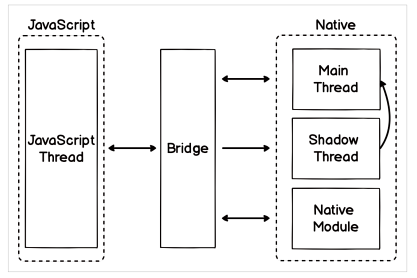

# 리액트 네이티브란?
- 2015년 3월에 페이스북에 의해 공개된 오픈소스 프로젝트로, 사용자 인터페이스를 만드는 리액트에 기반을 두고 제작되었다.
- 하지만 리액트와 달리 웹 브라우저가 아닌, ios와 안드로이드에서 동작하는 네이티브 모바일 어플리케이션을 만드는 자바스크립트 프레임워크이다.
- 현재 페이스북, 인스타그램, 핀터레스트, 월마트 등이 리액트 네이티브를 이용해서 개발되었으며, 리액트 네이티브 쇼케이스에서 대표적인 어플리케이션을 확인할 수 있다.
- 리액트 네이티브 쇼케이스 https://reactnative.dev/showcase.html
## 장점과 단점
- 리액트 네이티브가 출시되면서 오브젝티브-C 또는 자바를 사용하여 개발하지 않아도 웹 개발자가 익숙한 기술을 이용하여 모바일 개발을 통해 어플리케이션을 출시할 수 있는 기회를 얻게 되었다.
- 특히 리액트에 익숙한 개발자라면 조금 더 수월하게 리액트 네이티브를 익힐 수 있다.
### 장점
1. 작성된 코드 대부분 플랫폼간 공유가 가능해서 두 플랫폼을 동시에 개발할 수 있다는 것이다.
   -  특히 모바일 개발에 대한 지식이 없어도 자바스크립트만 알고 있으면 쉽게 시작할 수 있으며, 작성된 구성 요소들이 재사용 가능하다는 것은 리액트 네이티브가 갖고 있는 큰 장점이다.
2.  변경된 코드를 저장하기만 해도 자동으로 변경된 내용이 적용된 화면을 확인할 수 있는 fast refresh기능을 제공하고 있다.
   - 이 기능 덕분에 매번 수정하고 새로고침하는 번거로운 작업이 생략되고 즉각적인 수정 내용확인이 가능하다는 장점이 있다.
3. 작성된 코드에 따라 각 플랫폼에서 그에 알맞은 네이티브 엘리먼트로 전환되기 때문에 성능 저하 없이 개발이 가능하다.

### 단점
1. 네이티브 코드로 전환되는 장점은 있지만, 네이티브의 새로운 기능을 사용하는 데 오래걸린다.
   - 안드로이드나 ios에서 업데이트를 통해 새로운 API를 제공하더라도 리액트 네이티브가 이를 지원하기까지는 시간이 걸린다.
2. 유지보수가 어렵다
   - 개발 단계에서 문제가 생겼을 때 문제의 종류에 따라 원인을 찾고 문제를 해결하는 데 많은 시간이 걸린다.
3. 잦은 업데이트
   - 잦은 업데이트를 통해 버그를 수정하고 기능을 추가해주는 부분은 긍정적이지만, 너무 잦은 업데이트는 오히려 개발에 방해가 된다.
   - 또한 리액트를 사용하는 리액트 네이티브의 특성상 리액트의 버전 변화에 따라 리액트 네이티브에도 많은 변화가 생길 수 있다.

## 리액트 네이티브의 동작 방식

### 브릿지
- 리액트 네이티브에는 자바스크립트 코드를 이용해 네이티브 계층과 통신할 수 있도록 연겨하는 역할을 하는 브릿지가 있다.



- 브릿지는 자바스크립트 스레드에서 정보를 받아 네이티브로 전달한다.
- 자바스크립트 스레드는 자바스크립트 코드가 실행되는 장소이며 보통 리액트 코드로 구성되어 있다.
- 네이티브 영역에는 UI를 담당하는 메인 스레드가 있고, 레이아웃을 계산하는 데 사용하는 백그라운드 스레드인 섀도우 스레드가 있다.
- 네이티브 모듈들에는 자체 스레드가 있다.
- 단, 안드로이드의 경우 스레드 풀을 공유한다.
- 리액트 네이티브에서는 이렇게 기기와 통신하는 모든 자바스크립트의 기능을 분리된 스레드로 처리하면서 성능향상을 가져올 수 있었다.

### 가상DOM
- 리액트 네이티브의 동작 방식을 이해하려면 데이터가 변할 경우 자동으로 화면을 다시 그리는 리액트의 가상 DOM에 대해 이해해야 한다.


- 데이터가 변했을 때 화면이 다시 그려지는 과정은 다음과 같다.
1. 데이터에 변화가 있다.
2. 변화된 데이터를 이용하여 가상 DOM을 그린다.
3. 가상 DOM과 실제 DOM을 비교하여 차이점을 확인한다.
4. 차이점이 있는 부분만 실제 DOM에 적용하여 그린다.

- 여기서 실제 DOM은 우리가 보는 화면에 나타나는 DOM이고, 가상 DOM은 화며에 보이지 않지만 비교를 위해 존재하는 DOM이라고 생각하면된다.

### JSX
- 자바스크립트 확장 문법으로 XML과 매우 유사하다.
- 자바스크립트 코드 안에서 UI작업을 할 때 가독성에 도움을 주는 등 여러 가지 장점이 있으며 리액트에서 많이 사용되고 있다.
```JS
function formatName(user){
   return user.firstName + ' '+ user.lastName;
}

const User = {
   firstName : 'Beomjun',
   lastName : 'kim'
};

const element = <h1>hello, {formatName(user)}!</h1>
```
- JSX로 작성된 코드는 나중에 바벨(Babel)을 사용하여 자바스크립트로 변환된다.
- 위 코드를 변환하면 다음과 같은 자바스크립트 코드로 변경할 수 있다.

```JS
function formatName(user){
   return user.firstName + ' '+ user.lastName;
}

const User = {
   firstName : 'Beomjun',
   lastName : 'kim'
};

const element = /*#_PURE_*#/ React.createElement(
'h1',
null,
'Hello, ',
formatName(user),
'!'
)
```
- JSX로 작성된 코드의 가독성이 더 뛰어난 것을 알 수 있다.
- JSX는 가독성 뿐만 아니라 오류 검사에도 장점이 있다.
- 예를들어 위의 코드에서 h1태그를 닫지 않은 경우 바벨이 코드를 변환하는 과정에서 이 부분을 감지하고 알려준다.

# 개발환경 준비하기
- 리액트 네이티브는 맥, 윈도우, 리눅스 환경에서 개발이 가능하다.
- 맥 환경에서는 IOS,안드로이그 개발이 모두 가능하지만, 윈도우와 리눅스 환경에서는 안드로이드 개발만 가능하다.

## Node.js 설치
- https://nodejs.org/ko
- Node.js를 설치하면 노드 패키지 매니저인 npm도 같이 설치된다.
- 우리는 npm을 통해 전 세계 수 많은 개발자들이 만든 패키지를 설치하고 사용할 수 있다.

`Nodejs는 장기적으로 안정적인 지원을 제공하는 LTS(Long Term Support)버전을 매년 10월경에 변경하고 있다.`

- Node.js 웹사이트에서 LTS 버전을 다운로드 받아 설치를 진행하자

## Python 설치
- 리액트 네이티브는 빌드할 때 파이썬이 필요하다.
- ㅇㅇㅇ