# 채팅프로그램 만들기
- 지금까지 공부한 내용을 바탕으로 간단한 채팅 어플리케이션을 만들어보자.

## 구현할 기능 
- 로그인/회원가입 : 이메일과 비밀번호를 이용한 로그인과 회원가입
- 프로필 : 나의 정보 확인 및 변경
- 채널 생성 : 채널 생성 기능
- 채널 목록 : 생성된 채널들의 목록 조회
- 채널 : 실시간으로 메시지를 송수신하는 공간

## 프로젝트 생성하기
```js
expo init react-native-simple-chat
```

## 네비게이션
- 채팅 어플리케이션은 크게 세 부분으로 나눌것이다.
- 로그인 등 인증하는 화면
- 채팅방의 목록 등을 확인할 수 있는 화면
- 메시지를 주고받는 화면
- 화면은 유기적으로 연결되어 있으며 화면 간 이동이 잦다.

### 라이브러리 설치

#### @react-navigation/native
- 앱에서 화면간 네비게이션을 관리해줄 수있는 라이브러리
```
npm install @react-navigation/native@6.1.18
```
#### 주요기능
- NavigationContainer 제공
- 네비게이션 상태 관리
  - 앱의 현재 위치나 화면 전환과 같은 네비게이션 상태를 관리한다.
  - 이를 통해 사용자가 특정 화면에서 나가더라도 다시 돌아왔을 때 동일한 상태를 유지할 수 있게 하며, 히스토리 기반으로 백스택을 관리할 수 있다.
- 네비게이터와의 통합
  -  Stack, Tab, Drawer와 같은 네비게이터와 결합해 네비게이션 구조를 형성할 수 있다.

#### 기능관련 라이브러리 다운로드
```
expo install react-native-gesture-handler react-native-reanimated react-native-screens react-native-safe-area-context @react-native-community/masked-view
```

#### react-native-gesture-handler 
- 더 향상된 제스처 처리를 가능하게 해주는 라이브러리다.
- 기본적으로 React Native는 터치 이벤트를 제공하지만, 제스처를 복잡하게 사용할 때는 성능이나 일관성에서 제한이 있을 수 있다.
- 이 라이브러리는 그러한 한계를 극복하고 부드럽고 효율적인 제스처 인식을 제공한다.

#### 주요 기능
1. 복잡한 제스처 지원
     - 기본 제스처뿐 아니라 스와이프, 드래그, 핀치 줌 등 고급 제스처를 쉽게 인식하고 사용할 수 있다.
     - 여러 제스처를 동시에 인식하거나, 특정 제스처가 끝난 후 다른 제스처를 인식하는 방식으로 제스처 간의 우선순위와 조합을 설정할 수 있다.
2. 성능 개선
     - 네이티브에서 제스처를 처리하여 JS와 네이티브 간의 통신을 줄이기 때문에, React Native의 기본 터치 이벤트 시스템보다 부드럽고 빠르게 작동한다.
     - 네이티브에서 직접 제스처를 처리하므로, 스크롤 리스트나 드래그 앤 드롭과 같은 복잡한 UI에서도 성능이 뛰어나다.
3. react-navigation과의 통합
     - react-navigation과 완벽하게 호환되어 화면 전환, Drawer 네비게이션, 스택 네비게이션 등의 제스처 기반 네비게이션 동작을 구현하는 데 적합하다.
     - DrawerNavigation이나 StackNavigation에서 화면 전환을 제스처로 구현하는 경우, 이 라이브러리가 있어야 원활한 사용이 가능하다.

#### eact-native-screens
- 화면 전환 성능을 최적화하기 위한 라이브러리다. 
- 이 라이브러리는 iOS와 Android의 네이티브 화면 관리 기능을 활용하여 화면 간 전환을 더 부드럽게 하고, 메모리 사용을 줄여 성능을 향상시킨다. 
- 특히 `react-navigation`과 함께 사용할 때 효과적이다.

#### 주요 기능
1. **네이티브 스크린 관리**
   - `react-native-screens`는 네이티브 화면 관리 기능을 사용해 각 화면의 라이프사이클을 더 효과적으로 관리한다.
   - 각 화면이 메모리에 완전히 남아있지 않고, 비활성화되거나 숨겨진 화면은 메모리에서 제거하여 앱의 메모리 사용량을 줄인다.

2. **react-navigation과의 통합**
   - `react-native-screens`는 `react-navigation`의 Stack Navigator와 함께 사용할 때 성능 향상 효과가 크다.
   - Stack Navigator의 화면 전환이 네이티브 방식으로 처리되어, 화면 간 전환이 부드럽고 빠르게 동작한다.

3. **메모리 사용 최적화**
   - `react-native-screens`는 비활성 상태의 화면을 메모리에서 제거하거나, 네이티브 레벨에서 관리하여 전체적인 메모리 사용량을 줄인다.
   - 이를 통해 더 복잡한 네비게이션 구조에서도 성능 저하 없이 화면을 전환할 수 있다.

#### @react-native-community/masked-view
- 특정 영역을 가리거나 마스크 효과를 줄 때 사용하는 라이브러리다. 
- 이 라이브러리는 주로 화면 전환 애니메이션에서 화면이 겹쳐 보이지 않도록 마스크 처리를 하거나 특정 부분만 보이게 할 때 활용된다.

#### 주요 기능
1. **화면 마스킹**
   - 화면의 특정 영역만 보이도록 제한하여, 원하는 부분에만 마스크 효과를 줄 수 있다.
   - 예를 들어, 둥근 모서리를 가진 이미지나 특정 영역만 표시되는 UI를 구현할 때 유용하다.

2. **react-navigation과의 통합**
   - `@react-native-community/masked-view`는 `react-navigation`의 Stack Navigator와 함께 자주 사용된다.
   - Stack Navigator의 화면 전환 애니메이션을 사용할 때, 이전 화면이 겹쳐 보이지 않도록 마스킹 효과를 적용하여 깔끔한 화면 전환을 구현할 수 있다.

### 바텀탭바 라이브러리 설치
```
npm install @react-navigation/bottom-tabs@6.5.20
```

### styled components와 props-types 설치
```js
npm install styled-components prop-types
```

<p>$\{\large{\color{#DD6565}※ styled-components를\ 설치할\ 때\ 주의할 점}}$</p>
<p>$\{\large{\color{#DD6565} react와\ react-dom의\ 버전이\ 맞지\ 않아\ 에러가\ 날\ 수\ 있다.}}$</p>
<p>$\{\large{\color{#6580DD} npm install react-dom@18.3.1을}}$$\{\large{\color{#DD6565}\ 해서\ 버전을\ 맞추고\ 다시\ 설치해보자}}$</p>


#### prop-types
- `prop-types`는 React 컴포넌트에서 전달받는 `props`의 타입을 검증해주는 라이브러리다. 
- 컴포넌트에 전달되는 `props`의 타입과 값이 예상한 형태인지 확인할 수 있으며, 개발 중 잘못된 `props`가 전달될 경우 경고 메시지를 출력해 디버깅에 도움을 준다.

#### 주요기능
1. **타입 검증**
   - `prop-types`를 사용하여 `props`의 데이터 타입을 미리 정의할 수 있다. 
   - 잘못된 타입의 `props`가 전달되면 콘솔에 경고 메시지가 출력된다.
   
2. **기본값 설정**
   - 컴포넌트에 `defaultProps`를 설정해 `props`가 전달되지 않았을 때 기본값을 사용할 수 있다.

3. **유연한 타입 설정**
   - 다양한 데이터 타입을 검증할 수 있으며, 특정 조건을 만족하는 타입도 정의할 수 있다. `number`, `string`, `array`, `object` 등 다양한 타입 검증을 지원한다.

### 추가적인 라이브러리
- 위의 라이브러리 외에도 프로젝트를 진행하면서 다음과 같은 라이브러리를 사용할 예정이다.
- 추가적인 라이브러리는 사용되는 곳을 명확하게 알기 위해 필요한 상황이 오면 설치하고 사용하자.
- expo-image-picker
  - 기기의 사진이나 영상을 가져올 수 있도록 시스템 UI에 접근할 수 있는 기능을 제공한다.
  - 이번 프로젝트에서 기기의 사진을 선택해 사용자의 사진을 설정 혹은 변경하기 위해 사용할 예정이다.
- moment
  - 시간을 다양한 형태로 변경하는 등 시간과 관련된 많은 기능을 제공하는 라이브러리로, 날짜와 관련된 라이브러리 중 가장 널리 알려져 있고 많이 사용되고 있다.
  - 여기서는 타밍스탬프를 사용자가 보기 편한 형태로 변경하기 위해 사용할 예정이다.
- react-native-keyboard-aware-scroll-view
  - 키보드가 화면을 가리면서 생기는 불편한 점을 해결하기 위해 사용되는 라이브러리이다.
- react-native-gifted-chat
  - 메시지를 주고받는 채팅 화면을 쉽게 구현할 수 있도록 돕는 라이브러리이다.

### 프로젝트 파일 구조
- 모든 소스 파일을 관리할 src폴더를 생성한 후 theme.js파일을 생성하고 다음과 같이 작성하자.
```js
const colors = {
    white : '#ffffff',
    black : '#000000',
    grey_0 : '#d5d5d5',
    grey_1 : '#a6a6a6',
    red : '#e84118',
    blue : '#3679fe',
};

export const theme = {
    background : colors.white,
    text : colors.black,
}
```
- 공통으로 사용할 색을 적의하고 배경색과 글자의 색을 미리 정했다.
- 이번에는 최상위 컴포넌트가 사용될 App 컴포넌트를 src폴더 안에 작성해보자.
```js
import React from 'react'
import {StatusBar} from 'react-native'
import {ThemeProvider} from 'styled-components'
import {theme} from './theme'

const App = () => {
    return(
        <ThemeProvider theme={theme}>
            <StatusBar barStyle='dark-content' />
        </ThemeProvider>
    )
}

export default App;
```
- 스타일드 컴포넌트의 ThemeProvider 컴포넌트를 사용해 스타일드 컴포넌트에서 정의된 theme을 사용할 수 있도록 작성했다.
- 이번에는 루트 디렉터리에 있는 App.js파일을 수정해서 우리가 만든 App 컴포넌트가 메인 파일이 되도록 수정해보자.
```js
import App from "./src/App";

export default App;
```

#### 그 외 폴더
- src폴더 밑에 각 역할에 맞는 파일을 관리할 폴더를 다음과 같이 생성하자
- components : 컴포넌트 파일 관리
- contexts : Context API 파일 관리
- navigations : 네비게이션 파일 관리
- screens : 화면 파일 관리
- utils : 프로젝트에서 이용할 기타 기능 관리

# 파이어베이스
- 구글에서 제공하는 **클라우드 기반 개발 플랫폼**으로, 서버리스 애플리케이션을 쉽게 개발하고 배포할 수 있도록 다양한 백엔드 서비스를 제공한다. 
- 주로 모바일 앱과 웹 애플리케이션 개발에 사용되며, 실시간 데이터베이스, 인증, 클라우드 저장소, 푸시 알림 등의 기능을 손쉽게 구현할 수 있다.
- 파이어베이스가 제공하는 기능을 이용하면 대부분의 서비스에서 필요한 서버와 데이터베이스를 직접 구축하지 않아도 개발이 가능하다는 장점이 있다.

## 주요 기능과 서비스
1. **Firebase Authentication**
   - 다양한 인증 방식을 지원하여 사용자의 로그인과 회원가입을 간편하게 구현할 수 있다.
   - 이메일/비밀번호, 전화번호, 소셜 로그인(Google, Facebook, Twitter 등), 익명 인증 등을 제공한다.

2. **Firebase Realtime Database**
   - 클라우드 기반의 NoSQL 데이터베이스로, 데이터가 실시간으로 동기화된다.
   - 사용자가 데이터베이스의 업데이트를 즉시 받을 수 있어, 실시간 채팅, 라이브 업데이트 기능 등을 구현할 때 유용하다.

3. **Cloud Firestore**
   - 확장성과 유연성을 갖춘 NoSQL 문서형 데이터베이스로, Realtime Database와 유사하지만 더 강력하고 복잡한 쿼리를 지원한다.
   - 서버리스 아키텍처로, 데이터베이스를 서버에 배포하지 않고도 대규모 데이터베이스를 관리할 수 있다.

4. **Firebase Storage**
   - 이미지, 동영상, 파일 등을 저장하고 관리할 수 있는 클라우드 스토리지 서비스다.
   - 대용량 파일을 안전하게 저장하고, 업로드 및 다운로드 기능을 손쉽게 구현할 수 있다.

5. **Firebase Cloud Messaging (FCM)**
   - 푸시 알림을 전송할 수 있는 무료 메시징 서비스다.
   - 기기 간의 푸시 알림이나 주제별 메시지를 손쉽게 전송할 수 있어, 사용자에게 실시간 알림을 보낼 때 유용하다.

6. **Firebase Hosting**
   - 정적 웹사이트나 단일 페이지 애플리케이션(SPA)을 위한 빠르고 안전한 호스팅 서비스다.
   - Firebase CLI를 통해 빠르게 배포할 수 있으며, SSL 인증서가 자동으로 적용되어 안전한 HTTPS 통신을 제공한다.

7. **Firebase Analytics**
   - 앱 사용자 행동을 분석하여 사용자 인터랙션에 대한 인사이트를 제공하는 분석 도구다.
   - Google Analytics 기반으로, 실시간 사용자 정보, 사용자 속성, 이벤트 추적 등을 지원한다.

8. **Firebase Cloud Functions**
   - 서버리스 환경에서 백엔드 코드를 실행할 수 있는 기능이다.
   - 이벤트 기반으로 트리거되는 함수로, 데이터베이스 변경, 인증, FCM 등을 활용하여 백엔드 로직을 처리할 수 있다.

## 파이어베이스 사용하기
- 파이어베이스를 이용하려면 파이어베이스 콘솔에서 프로젝트를 생성해야 한다.
https://console.firebase.google.com/

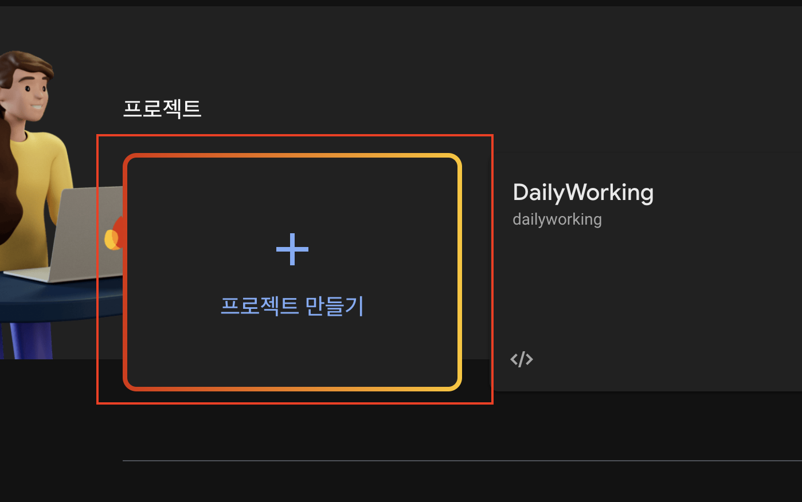


- 앱을 추가하는 과정에서 입력해야 하는 앱의 닉네임은 편의상 지정하는 내부용 식별자이므로 여러분이 지정하고 싶은 이름을 입력하면 된다.(simplechat)

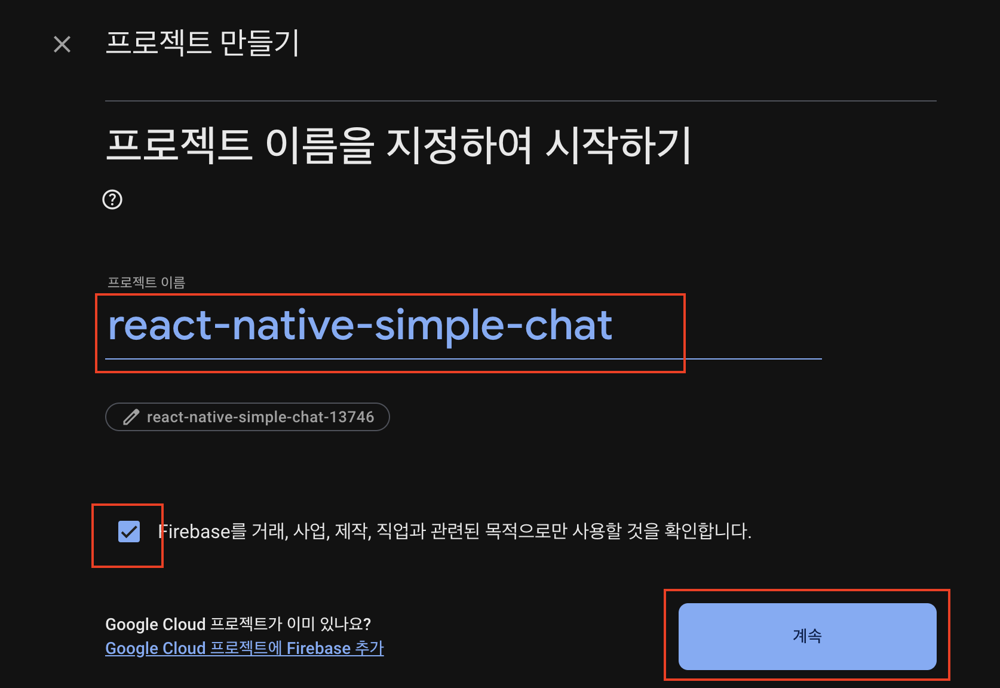

- 파이어베이스를 사용하기 위한 설정갑들을 확인할 수 있다.
- 이 값들은 외부에 노출되면 안되는 중요한 값들이므로 잘 관리해야 한다.
- 이제 프로젝트의 루트 디렉터리에 firebase.json 파일을 생성한 후 이 코드를 다음과 같은 형태로 복사하고 .gitignore파일에 firebase.json을 추가해주자.
```json
{
  "apiKey": "...",
  "authDomain": "...",
  "projectId": "...",
  "storageBucket": "...",
  "messagingSenderId": "...",
  "appId": "...",
  "measurementId": "..."
}
```
- .gitignore에 추가하기
```
...
# firebase
firebase.json
```
- 이제 프로젝트에서 파이어베이스를 사용하기위한 준비가 완료되었다.
- 채팅 어플리케이션을 만들기 위해 알아야 할 인증, 데이터베이스, 스토리지 기능에 대해서 알아보자.

### 인증
- 파이어베이스 인증 기능에서는 다양한 인증 방법을 제공한다.
- 우리는 이메일과 비밀번호를 이용하여 인증할 수 있는 기능을 만들 예정이므로 "이메일/비밀번호"부분만 활성화 하고 진행한다.

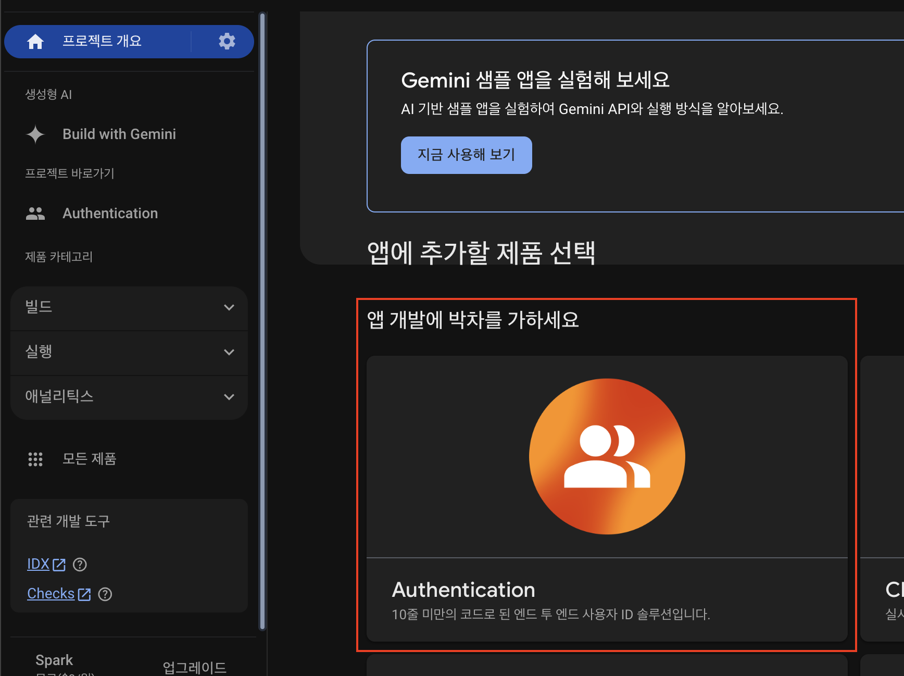

- 로그인 방법 설정 버튼을 누른다.
- 이메일/비밀번호 버튼을 누른다.

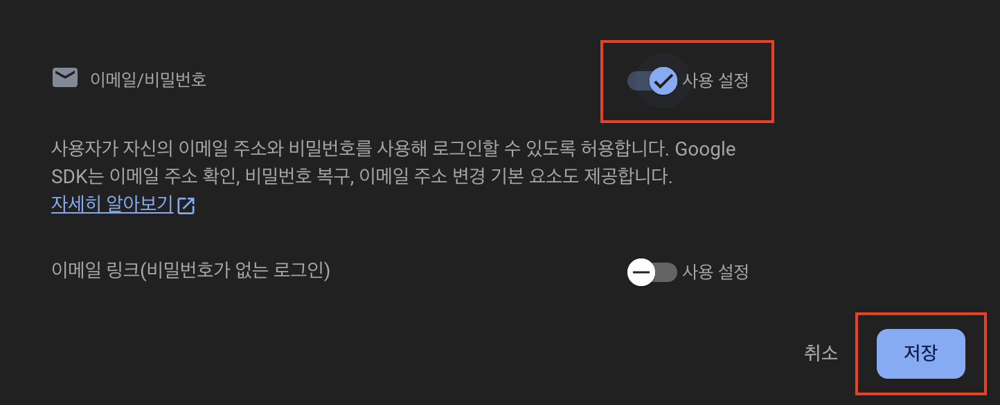

- 토글을 활성화하고 저장버튼을 누른다.

### 데이터베이스
- 생성되는 채널과 각 채널에서 발생하는 메시지를, 파이어베이스의 데이터베이스를 이용하여 관리한다.
- 데이터베이스의 경우 파이어스토어와 실시간 데이터베이스 두 가지 종류를 제공하는데, 우리는 파이어스토어를 이용할 것이다.
- 데이터베이스를 사용하려면 데이터베이스 메뉴에서 데이터베이스 만들기를 진행해야 한다.
- 데이터베이스 만들기의 첫 번째 단계인 보안 규칙은 뒤에서 조금 더 다루고, 두번째 단계인 위치를 선택하는 화면에서는 여러분이 서비스하는 지역과 가장 가까운 지역을 선택하는 것이 좋다.

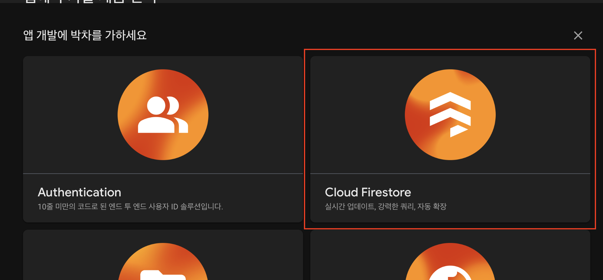

- 지역만 asia-northeast3(서울)을 선택하고 다른것은 건드리지말고 넘어갑니다.

### 스토리지
- 서버 코드 없이 사용자의 사진, 동영상 등을 저장할 수 있는 기능을 쉽게 개발할 수 있도록 기능을 제공한다.
- 여기서는 스토리지를 이용해 채팅 어플리케이션에 가입한 사용자의 사진을 저장하고 가져오는 기능을 만들어볼 것이다.
- 2024년 부터 블레이즈 요금제로 바꿔야 스토리지를 사용가능하다.
- 무료 사용량이 있고 그 이후에 과금이 된다.
- 모든 위치에서 서울로 바꾸자

### 라이브러리 설치
- 리액트 네이티브에서 파이어베이스를 사용하기 위해 라이브러리를 설치하자
```
npm install firebase --legacy-peer-deps
```
- 라이브러리 설치가 완료되면 utils폴더 아래에 firebase.js파일을 생성하고 다음과 같이 작성한다.
```js
import * as firebase from 'firebase'
import config from '../../firebase.json'

const app = firebase.initializeApp(config);
```

## 앱 아이콘과 로딩화면
- 프로젝트의 기능과 화면 개발에 앞서 앱의 아이콘과 로딩 화면을 먼저 변경해보자.
- assets 폴더에 아이콘으로 사용할 1024x1024크기의 이미지를 icon.png로, 로딩화면에 사용할 1242x2436크기의 이미지를 splash.png파일로 교체해 넣는다.
- 그리고 src폴더에 App.js를 수정한다.

### expo-splash-screen
- expo-app-loading패키지는 expo sdk 46부터 더이상 사용되지 않으며, expo-splash-screen을 사용하도록 권장된다.
### 설치
```js
npm install expo-splash-screen
```

```js
import React, { useState, useEffect } from 'react';
import { StatusBar, Image } from 'react-native';
import { Asset } from 'expo-asset';
import * as Font from 'expo-font';
import * as SplashScreen from 'expo-splash-screen'; // expo-splash-screen을 불러옴
import { ThemeProvider } from 'styled-components/native';
import { theme } from './theme';

// 스플래시 화면이 자동으로 숨겨지지 않도록 설정하여 초기화 작업이 완료될 때까지 유지함
SplashScreen.preventAutoHideAsync();

const cacheImages = images => {
    // 이미지 캐싱 함수: 문자열로 전달된 URL 이미지와 로컬 파일 이미지에 따라 각각 적절한 캐싱 방식으로 처리
    return images.map(image => {
        if (typeof image === 'string') {
            return Image.prefetch(image); // URL로 제공된 이미지의 경우, Image.prefetch로 캐싱
        } else {
            return Asset.fromModule(image).downloadAsync(); // 로컬 파일의 경우, expo-asset에서 제공하는 다운로드 방식으로 캐싱
        }
    });
};
```
- `prefetch()`는 원격 URL의 이미지를 캐싱하기 위해 사용된다. 주로 웹에서 이미지를 가져올 때 사용하며, 이미지가 앱 내에서 사용되기 전에 미리 로드해두어 로딩 속도를 높인다.
- `fromModule()`는 로컬 파일을 Asset 모듈로 가져와 관리한다. 주로 require()로 가져온 로컬 파일을 expo-asset의 Asset 객체로 변환할 때 사용된다.
- `downloadAsync()`는 로컬 리소스(이미지, 동영상 등)를 미리 캐싱하는 기능을 제공한다. 이 함수는 Asset 객체에서 사용할 수 있으며, 로컬 파일을 캐싱하고 디바이스에 다운로드해 빠르게 접근할 수 있게 한다.

```js
const cacheFonts = fonts => {
    // 폰트 캐싱 함수: 폰트 배열을 받아 각 폰트를 로드
    return fonts.map(font => Font.loadAsync(font));
};

const App = () => {
    const [isReady, setIsReady] = useState(false); // 초기화 여부를 추적하는 상태 변수

    useEffect(() => {
        // useEffect에서 비동기 함수 호출하여 리소스를 로드
        const prepareResources = async () => {
            try {
                await _loadAssets(); // 리소스를 로드하는 비동기 함수 호출
            } catch (error) {
                console.warn(error); // 오류 발생 시 경고 메시지 출력
            } finally {
                setIsReady(true); // 로딩이 완료되면 isReady를 true로 설정
                await SplashScreen.hideAsync(); // 스플래시 화면 숨김
            }
        };

        prepareResources(); // 준비 함수 호출
    }, []); // 빈 의존성 배열을 전달하여 컴포넌트가 마운트될 때 한 번만 실행

    const _loadAssets = async () => {
        // 이미지와 폰트를 캐싱하여 리소스를 로드
        const imageAssets = cacheImages([require('../assets/splash.png')]); // 로컬 스플래시 이미지 캐싱
        const fontAssets = cacheFonts([]); // 추가적인 폰트가 있다면 이 배열에 추가 가능

        await Promise.all([...imageAssets, ...fontAssets]); // 모든 비동기 작업이 완료될 때까지 기다림
    };

```
#### require()
- 로컬 파일 리소스(이미지, 동영상, 사운드 파일 등)를 가져오는 데 사용된다. 
- React Native에서는 앱 내부의 파일 경로나 네트워크에서 동적으로 가져오는 파일을 사용하기 어렵기 때문에, 정적인 파일을 불러오는 방식으로 require()가 자주 사용된다.

#### 사용방식
1. 정적 파일 경로 요구
    - React Native에서 require()는 정적 경로로 파일을 가져와야 한다. 즉, 경로가 런타임에서 동적으로 결정될 수 없다.
    - ```const image = require('./assets/icon.png');```


```js
    if (!isReady) {
        return null; // 로딩이 완료되지 않은 경우 화면을 빈 상태로 유지
    }

    return (
        // 로딩 완료 시 앱의 실제 UI를 렌더링
        <ThemeProvider theme={theme}>
            <StatusBar barStyle="dark-content" /> {/* 상태 바 스타일 설정 */}
        </ThemeProvider>
    );
};

export default App;
```
- 앞으로 프로젝트에서 사용할 이미지와 폰트를 미리 불러와서 사용할 수 있도록 cacheImages와 cacheFonts함수를 작성하고 이를 이용해 _loadAssets함수를 구성했다.
- 이미지나 폰트를 미리 불러오면 애플리케이션을 사용하는 환경에 따라 이미지나 폰트가 느리게 적용되는 문제를 개선할 수 있다.
- 어플리케이션은 미리 불러와야 하는 항목들을 모두 불러오고 완료되었을 때 isReady상태를 변경해서 렌더링되도록한다.

## 인증 화면
- 파이어베이스의 인증 기능을 이용해서 로그인 화면과 회원가입 화면을 만들어보자.
- 인증을 위해 이메일과 비밀번호가 필요하므로 로그인 및 회원가입 화면에서는 이메일과 비밀번호를 필수로 입력받고, 회원가입 시 사용자가 서비스에서 사용할 이름과 프로필 사진을 받도록 화면을 구성하도록 하자.

### Stack네비게이션 설치
```js
npm install @react-navigation/stack@6.4.1
```

### 네비게이션
- 먼저 로그인 화면과 회원가입 화면으로 사용할 컴포넌트를 screens 폴더 밑에 만든다.

### Login.js
```js
import React from 'react';
import styled from 'styled-components';
import { Text,Button } from 'react-native';

const Container = styled.View`
  flex: 1;
  justify-content: center;
  align-items: center;
  background-color: ${({ theme }) => theme.background};
`;

const Login = ({ navigation }) => {
    return (
        <Container>
          <Text style={{fontSize: 30}}>Login Screen</Text>
          <Button title="Signup" onPress={() => navigation.navigate('Signup')}/>
        </Container>
    );
};
  
export default Login;
```
- 회원가입 화면으로 이동할 수 있는 버튼이 있는 간단한 로그인 화면을 만들었다.
- 이번에는 회원가입 화면을 만들어보자.

### Signup.js
```js
import React from 'react';
import styled from 'styled-components';
import { Text } from 'react-native';

const Container = styled.View`
  flex: 1;
  justify-content: center;
  align-items: center;
  background-color: ${({ theme }) => theme.background};
`;

const Signup = () => {
  return (
      <Container>
        <Text style={{fontSize : 30}}>Signup Screen</Text>
      </Container>
    
  );
};

export default Signup;
```
- 회원가입 화면도 로그인 화면과 마찬가지로 화면을 확인할 수 있는 텍스트가 있는 간단한 화면으로 구성했다.
- 두 화면이 완성되면 screens폴더에 index.js파일을 생성하고 다음과 같이 작성한다.
```js
import Login from "./Login";
import Signup from "./Signup";

export {Login,Signup}
```
- 이제 화면 준비가 완료되었으므로 네비게이션 파일을 작성해보자.
- 네비게이션 파일을 관리하는 navigations폴더에 스택 네비게이션을 이용해서 다음과 같이 작성하자.

### AuthStack.js
```js
import React, { useContext } from 'react';
import { ThemeContext } from 'styled-components/native';
import { createStackNavigator } from '@react-navigation/stack';
import { Login, Signup } from '../screens';

const Stack = createStackNavigator();

const AuthStack = () => {
  const theme = useContext(ThemeContext);
  return (
    <Stack.Navigator
      initialRouteName="Login"
      screenOptions={{
        headerTitleAlign: 'center',
        cardStyle: { backgroundColor: theme.background },
      }}
    >
      <Stack.Screen
        name="Login"
        component={Login}
      />
      <Stack.Screen
        name="Signup"
        component={Signup}
      />
    </Stack.Navigator>
  );
};

export default AuthStack;
```
- 첫 화면을 로그인 화면으로 하고 로그인 화면과 회원가입 화면을 가진 네비게이션을 만들었다.
- 스타일드 컴포넌트에서 제공하는 ThemeContext와 useContext Hook 함수를 이용해 theme을 받아오고, 네비게이션 화면의 배경색을 theme에 정의된 배경색으로 설정했다.
- 마지막으로 헤더의 타이틀 위치를 안드로이드와 iOS에서 동일한 위치에 렌더링하기 위해 headerTitleAlign의 값을 center로 설정했다.
- AuthStack 네비게이션 작성이 완료되면 navigation 폴더 안에 index.js파일을 생성하고 다음과 같이 작성한다.
```js
import React from "react";
import { NavigationContainer } from "@react-navigation/native";
import AuthStack from "./AuthStack";

const Navigation = () => {
    return(
        <NavigationContainer>
            <AuthStack />
        </NavigationContainer>
    )
}

export default Navigation;
```
- NavigationContainer 컴포넌트를 사용하고 자식 컴포넌트로 AuthStack 네비게이션을 사용했다.
- 이제 작성된 네비게이션이 렌더링되도록 App컴포넌트를 다음과 같이 수정하자.
```js
...
import Navigation from './navigations'

...

return (
    <ThemeProvider theme={theme}>
        <StatusBar barStyle="dark-content" />
        <Navigation />
    </ThemeProvider>
);


```

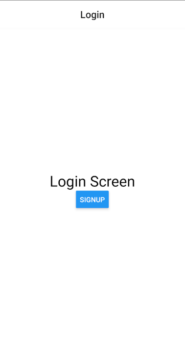 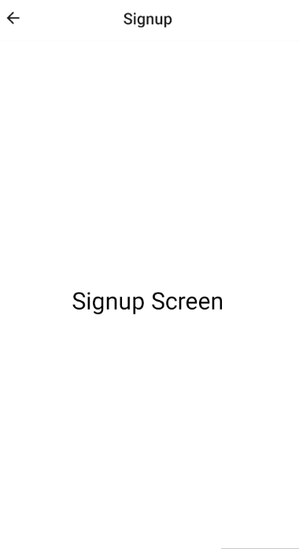


### 로그인 화면
- 로그인 화면에서 사용자의 이메일과 비밀번호를 입력받을 수 있도록 화면을 만들어보자.
- 로그인 화면에서는 로고를 렌더링하는 컴포넌트와 사용자의 입력을 받는 컴포넌트, 그리고 클릭과 그에 따른 이벤트가 발생하는 컴포넌트가 필요하다.

#### Image 컴포넌트
- 먼저 url을 전달받아 원격에 있는 이미지를 렌더링하는 Image컴포넌트를 만들어보자.
- 로그인 화면에서는 Image 컴포넌트를 이용해 어플리케이션의 로고를 렌더링한다.
- 우선 Image 컴포넌트의 배경색으로 사용할 값을 theme.js에 정의한다.

```js
export const theme = {
    background : colors.white,
    text : colors.black,
    ImageBackground: colors.grey_0,
}
```
- Image 컴포넌트를 작성할 Image.js파일을 components폴더 안에 만든다.
```js
import React from 'react';
import styled from 'styled-components/native';
import PropTypes from 'prop-types';

const Container = styled.View`
  align-self: center;
  margin-bottom: 30px;
`;
const StyledImage = styled.Image`
  background-color: ${({ theme }) => theme.imageBackground};
  width: 100px;
  height: 100px;
`;

const Image = ({ url, imageStyle}) => {
    return (
      <Container>
        <StyledImage source={{uri:url }} style={imageStyle} />      
      </Container>
    );
  };
  
  Image.propTypes = {
    uri: PropTypes.string,
    imageStyle: PropTypes.object,
  };
  
  export default Image;
```
- props로 전달되는 url을 렌더링하고 imageStyle을 전달받아 컴포넌트의 스타일을 수정할 수 있는 Image 컴포넌트를 만들었다.
- Image 컴포넌트 작성이 완료되면 components 폴더에 index.js파일을 생성하고 다음과 같이 작성한다.

```js
import Image from "./Image";

export {Image};
```
- 이제 Image 컴포넌트를 사용해서 Login 화면을 수정해보자.

```js
...
import { Image } from '../components';

...
<Container>
    <Image />
    <Button title="Signup" onPress={() => navigation.navigate('Signup')}/>
</Container>
```

#### 로고 적용하기
- 이번에는 어플리케이션의 로고를 파이어베이스 스토리지에 업로드하고 로그인 화면에서 사용하도록 만들어보자.
- 앞에서 작성한 Image 컴포넌트의 크기인 100x100보다 큰 사이즈 로고 이미지를 준비하고, 파일을 파이어베이스의 스토리지에 업로드한다.


- 스토리지에 파일을 업로드하고 파일 정보에서 이름을 클릭하면 해당 파일의 url을 얻을 수 있다.

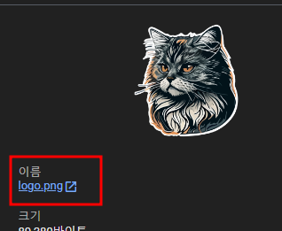

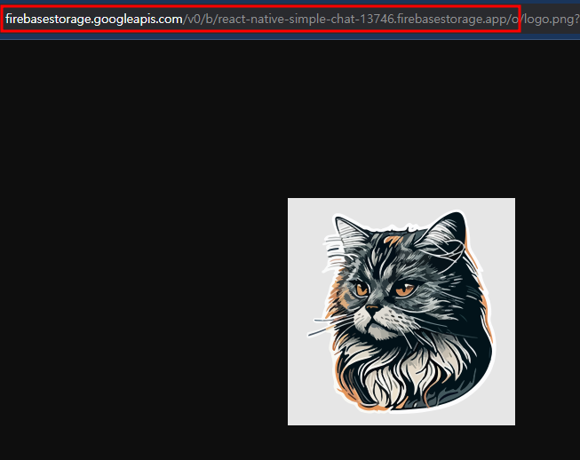

- 스토리지에 업로드된 이미지의 url을 관리하기 위해 utils폴더에 images.js파일을 생성하고 앞에서 얻은 url을 이용해 다음과 같이 생성한다.
- 복사된 주소의 쿼리 스트링에서 token 부분을 제외하고 사용해야 한다.
- 쿼리 스트링에 있는 token은 현재 로그인된 사용자에게 발급된 값이다.
- 실제 사용할 때는 token이 변경될 뿐만 아니라, 로그인 화면에서는 아직 로그인 전이므로 token이 없는 상태로 접근이 가능해야 한다.

```js
const prefix = 'url경로'

export const images = {
    logo : `${prefix}/logo.png?alt=media`;
}
```

- 이제 로고 이미지도 로딩 과정에서 미리 불러오도록 App컴포넌트를 수정하자.
```js
...
import { images } from './utils/images';
...
const _loadAssets = async () => {
    const imageAssets = cacheImages([
        require('../assets/splash.png'),
        ...Object.values(images),
    ]);
    const fontAssets = cacheFonts([]);

    await Promise.all([...imageAssets, ...fontAssets]);
};
```
- 마지막으로 로그인 화면에서 준비된 로고 이미지를 불러오자
```js
...
import { images } from '../utils/images';

...
<Container>
    <Image url={images.logo}/>
    <Button title="Signup" onPress={() => navigation.navigate('Signup')}/>
</Container>
```
- 결과를 보면 업로드한 이미지가 나타나지 않고 다음과 같은 경고 메시지가 뜬다.
```
[Error: Unexpected HTTP code Response{protocol=h2, code=403, message=, url=https://firebasestorage.googleapis.com/v0/b/react-native-simple-chat-13746.firebasestorage.app/o/logo.png?alt=media}]
```
- 이 문제는 스토리지의 파일 접근 권한 문제로, 보안 규칙을 수정해서 해결해야 한다.
- 스토리지 메뉴의 "Rules"탭에서 로그인하지 않아도 파일을 읽을 수 있도록 다음과 같이 규칙을 수정해주자.

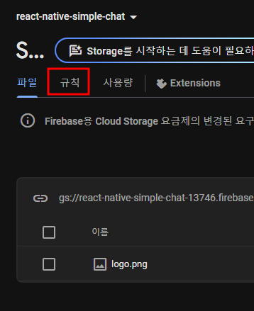

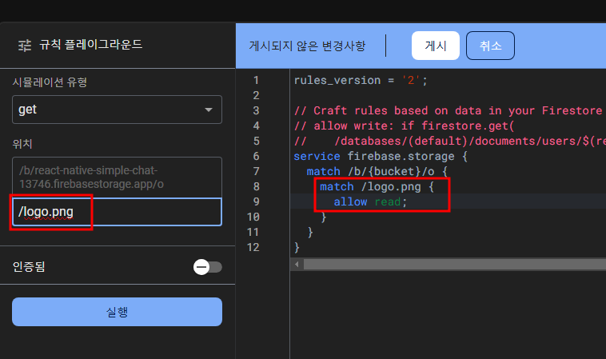

- 규칙을 적용시키고 화면을 다시 확인하면 스토리지에 업로드한 로고가 잘 나타나는 것을 볼 수 있다.
- 마지막으로 로그인 화면에서 Image 컴포넌트에 imageStyle을 전달해 렌더링되는 로고의 모습을 조금만 변경하자.

```js
const Login = ({ navigation }) => {
    
    return (
        <Container>
          <Image url={images.logo} style={{borderRadius : 8}}/>
          <Button title="Signup" onPress={() => navigation.navigate('Signup')}/>
        </Container>

    );
  };

```

#### Input 컴포넌트
- 아이디와 비밀번호를 입력받을 수 있도록 Input 컴포넌트를 만들어보자.
- theme.js에 먼저 Input컴포넌트에서 placeholder등에 사용할 색을 정의하자.
```js
export const theme = {
    ...
    label : colors.grey_1,
    inputPlaceholder : colors.grey_1,
    inputBorder : colors.grey_1,
}
```
- 동일한 색을 사용했지만 이후 유지보수를 위해 적용되는 부분을 명확하게 알 수 있도록 정의했다.
- 이제 components 폴더에 Input.js파일을 생성하고 Input 컴포넌트를 만들자.
```js
import React, { useState, forwardRef } from 'react';
import styled from 'styled-components/native';
import PropTypes from 'prop-types';

const Container = styled.View`
  flex-direction: column;
  width: 100%;
  margin: 10px 0;
`;
const Label = styled.Text`
  font-size: 14px;
  font-weight: 600;
  margin-bottom: 6px;
  color: ${({ theme, isFocused }) => (isFocused ? theme.text : theme.label)};
`;

const StyledTextInput = styled.TextInput.attrs(({ theme }) => ({
  placeholderTextColor: theme.inputPlaceholder,
}))`
  background-color: ${({theme}) => theme.background};
  color: ${({ theme }) => theme.text};
  padding: 20px 10px;
  font-size: 16px;
  border: 1px solid
    ${({ theme, isFocused }) => (isFocused ? theme.text : theme.inputBorder)};
  border-radius: 4px;
`;

const Input = ({
    label,
    value,
    onChangeText,
    onSubmitEditing,
    onBlur,
    placeholder,
    isPassword,
    returnKeyType,
    maxLength
}) => {
    const [isFocused, setIsFocused] = useState(false);
    return (
      <Container>
        <Label isFocused={isFocused}>{label}</Label>
        <StyledTextInput
          isFocused={isFocused}
          value={value}
          onChangeText={onChangeText}
          onSubmitEditing={onSubmitEditing}
          onFocus={() => setIsFocused(true)}
          onBlur={() => {
            setIsFocused(false);
            onBlur();
          }}
          placeholder={placeholder}
          secureTextEntry={isPassword}
          returnKeyType={returnKeyType}
          maxLength={maxLength}
          autoCapitalize="none"
          autoCorrect={false}
          textContentType="none" // iOS only
          underlineColorAndroid="transparent" // Android only
        />
      </Container>
    );
  }

Input.defaultProps = {
  onBlur: () => {},
};

Input.propTypes = {
  label: PropTypes.string.isRequired,
  value: PropTypes.string.isRequired,
  onChangeText: PropTypes.func,
  onSubmitEditing: PropTypes.func,
  onBlur: PropTypes.func,
  placeholder: PropTypes.string,
  isPassword: PropTypes.bool,
  returnKeyType: PropTypes.oneOf(['done', 'next']),
  maxLength: PropTypes.number,
};

export default Input;
```
- 라벨을 TextInput 컴포넌트 위에 렌더링하고 포커스 여부에 따라 스타일이 변경되는 Input 컴포넌트를 만들었다.
- secureTextEntry 속성은 입력되는 문자를 감추는 기능으로 비밀번호를 입력하는 곳에서 많이 사용된다.
- Input 컴포넌트 작성이 완료되면 components 폴더의 index.js를 수정한다.
```js
import Image from "./Image";
import Input from "./Input";

export {Image, Input};
```
- 이제 사용자의 이메일과 비밀번호를 입력받을 수 있도록 Input 컴포넌트를 이용해 로그인 화면을 다음과 같이 수정하자.
```js
import React, {useState} from 'react';
...
import { Image,Input } from '../components';
...

const Container = styled.View`
  flex: 1;
  justify-content: center;
  align-items: center;
  background-color: ${({ theme }) => theme.background};
  padding : 20px;
`;

const Login = ({ navigation }) => {
    const[email, setEmail] = useState('');
    const[password,setPassword] = useState('');
    
    return (
        <Container>
          <Image url={images.logo} style={{borderRadius : 8}}/>
          <Input
          label="Email"
          value={email}
          onChangeText={text => setEmail(text)}
          onSubmitEditing={() => {}}
          placeholder="Email"
          returnKeyType="next"
        />
        <Input
          label="Password"
          value={password}
          onChangeText={text=>setPassword(text)}
          onSubmitEditing={() => {}}
          placeholder="Password"
          returnKeyType="done"
          isPassword
        />
        </Container>

    );
  };
  
  export default Login;
```

- 입력되는 이메일과 비밀번호를 관리할 email과 password를 useState 함수로 생성하고 각각 이메일과 비밀번호를 입력받는 Input 컴포넌트의 value로 지정했다.
- 비밀번호를 입력받는 Input 컴포넌트는 입력되는 값이 보이지 않도록 isPassword 속성을 추가했다.


- 로그인 화면에서 이메일을 입력받는 Input 컴포넌트의 returnKeyType을 next로 설정하고 비밀번호를 입력받는 Input 컴포넌트는 done으로 설정했다.
- 이번에는 useRef를 이용해 이메일을 입력받는 Input컴포넌트에서 키보드의 next버튼을 클릭하면 비밀번호를 입력하는 Input 컴포넌트로 포커스가 이동하는 기능을 추가해보자.

```js
import React, {useState,useRef} from 'react';
...
const Login = ({ navigation }) => {
    const[email, setEmail] = useState('');
    const[password,setPassword] = useState('');
    const passwordRef = useRef();

...

<Input
        label="Email"
        value={email}
        onChangeText={text => setEmail(text)}
        onSubmitEditing={() => passwordRef.current.focus()}
        placeholder="Email"
        returnKeyType="next"
    />
    <Input
        ref={passwordRef}
...
```

- useRef를 이용하여 passwordRef를 만들고 비밀번호를 입력하는 Input 컴포넌트의 ref로 지정했다.
- 이메일을 입력하는 Input 컴포넌트의 onSubmitEditing함수를 passwordRef를 이용해서 비밀번호를 입력하는 Input 컴포넌트로 포커스가 이동되도록 수정했다.
- 이제 Input 컴포넌트에 전달된 ref를 이용해 TextInput 컴포넌트의 ref로 지정해야한다.
- 하지만 ref는 key처럼 리액트에서 특별히 관리도기 때문에 자식 컴포넌트의 props로 전달되지 않는다.
- 이런 상황에서 forwardRef함수를 이용하면 ref를 전달받을 수 있다.
- Input.js 수정하기
```js
import React, { useState, forwardRef } from 'react';
...

const Input = forwardRef(
    (
      {
        label,
        value,
        onChangeText,
        onSubmitEditing,
        onBlur,
        placeholder,
        isPassword,
        returnKeyType,
        maxLength,
      },
      ref
    ) => {
    const [isFocused, setIsFocused] = useState(false);
    return (
      <Container>
        <Label isFocused={isFocused}>{label}</Label>
        <StyledTextInput
          ref={ref}
          isFocused={isFocused}
          value={value}
          onChangeText={onChangeText}
          onSubmitEditing={onSubmitEditing}
          onFocus={() => setIsFocused(true)}
          onBlur={() => {
            setIsFocused(false);
            onBlur();
          }}
          placeholder={placeholder}
          secureTextEntry={isPassword}
          returnKeyType={returnKeyType}
          maxLength={maxLength}
          autoCapitalize="none"
          autoCorrect={false}
          textContentType="none" // iOS only
          underlineColorAndroid="transparent" // Android only
        />
      </Container>
    );
  }
);
```

#### 키보드 감추기
- 키보드가 Input태그를 가리는 문제와 다른곳을 클릭했을 때 키보드가 사라지게 만들어보자.
```js
npm install react-native-keyboard-aware-scroll-view
```
- react-native-keyboard-aware-scroll-view 라이브러리는 포커스가 있는 TextInput 컴포넌트의 위치로 자동 스크롤되는 기능 등 Input 컴포넌트에 필요한 기능들을 제공한다.

- Login.js 코드 수정하기
```js
...

import { KeyboardAwareScrollView } from 'react-native-keyboard-aware-scroll-view';

 <KeyboardAwareScrollView
        contentContainerStyle={{flex:1}}
        extraScrollHeight={20}
      >
      <Container>
        ...
        
      </Container>
 </KeyboardAwareScrollView>
```

### 오류 메시지
- Input 컴포넌트에 입력되는 값이 올바른 형태로 입력되었는지 확인하고, 잘못된 값이 입력되면 오류 메시지를 보여주는 기능을 만들어보자.
- 먼저 오류 메시지에서 사용할 색을 theme.js파일에 정의하고 진행하자.
```js
export const theme = {
    ...
    errorText : colors.red,
}

```
- 색의 정의가 완료되면 utils 폴더에 common.js파일을 생성하고 올바른 이메일 형식인지 확인하는 함수와 입력된 문자열에서 공배을 모두 제거하는 함수를 만들자.

```js
export const validateEmail = email => {
  const regex = /^[0-9?A-z0-9?]+(\.)?[0-9?A-z0-9?]+@[0-9?A-z]+\.[A-z]{2}.?[A-z]{0,3}$/;
  return regex.test(email);
};

export const removeWhitespace = text => {
  const regex = /\s/g; //문자열 전체에서 공백을 찾는다.
  return text.replace(regex, '');
};
```

### 정규표현식
#### 대괄호 : 괄호 안의 하나의 문자와 일치
- [abc] : a또는 b 또는 c 중 하나와 일치
- [a-z] : 소문자 알파벳중 하나
- [A-Z] : 대문자 알파벳중 하나
- [0-9] : 숫자 중 하나와 일치
- [a-zA-Z0-9]: 알파벳 대소문자, 숫자 중 하나와 일치
- [^abc] : a,b,c가 아닌 문자

- . : 모든 문자 하나와 일치
- \d : [0-9]
- \D : [^0-9]
- \w : [A-Za-z_]
- \W : [^A-Za-z_]
- \s : 공백을 찾는다.

#### 반복

- \* : 앞의 패턴이 0번이상 반복
  - ex) a* : a가 없거나 여러번 반복되는 경우와 일치

- \+ : 앞의 패턴이 1번 이상 반복
  - ex) a+ : a가 한번 이상 나타나는 경우와 일치

- ? : 앞의 패턴이 0번 또는 1번 나타나는 경우와 일치
  - ex) a? : a가 없거나 1번 나타나는 경우와 일치

- {n} : 정확히 n번 반복
  - ex) a{3} : a가 정확히 3번 나오는 경우와 일치

- {n,} : 최소 n번 반복
  - ex) a{2,} : a가 최소 2번 나타나는 경우와 일치

- {n,m} : n번에서 m번 사이 반복
  - ex) a{1,3} : a가 1번 이상 3번 이하로 나타나는 경우와 일치

#### Login.js 코드 수정하기
```js
import {validateEmail, removeWhitespace} from '../utils/common'

const ErrorText = styled.Text`
  align-items : flex-start;
  width: 100%;
  height: 20px;
  margin-bottom: 10px;
  line-height: 20px;
  color: ${({theme}) => theme.errorText};
`

const Login = ({ navigation }) => {
    ...

    const [errorMessage, setErrorMessage] = useState('');

    const _handleEmailChange = email => {
      const changedEmail = removeWhitespace(email);
      setEmail(changedEmail);
      setErrorMessage(
        validateEmail(changedEmail) ? '' : 'Please verify your email.'
      );
    };

    const _handlePasswordChange = password => {
      setPassword(removeWhitespace(password));
    };
    return(
      ...
       <Input
          label="Email"
          value={email}
          onChangeText={_handleEmailChange}
          ...
        />
        <Input
          ref={passwordRef}
          label="Password"
          value={password}
          onChangeText={_handlePasswordChange}
          ...
        />
        <ErrorText>{errorMessage}</ErrorText>
        ...
    )
```
- 이메일에는 공백이 존재하지 않으므로 email의 값이 변경될 때마다 공백을 제고하도록 수정하고 validateEmail 함수를 이용해 공백이 제거된 이메일이 올바른 형식인지 검사했다.
- 마지막으로 검사 결과에 따라 오류 메시지가 나타나도록 로그인 화면을 수정했다.
- 비밀번호도 공백을 허용하지 않기 위해 제거하는 코드가 추가됐다.


### Button 컴포넌트
- 로그인 버튼 등으로 활용될 Button 컴포넌트를 만들어보자.
- 먼저 버튼에서 사용할 색을 theme.js파일에 정의한다.
```js
export const theme = {
    ...
    buttonBackground : colors.blue,
    buttonTitle : colors.white,
    buttonUnfilledTitle : colors.blue,
}
```
- 내부가 채워지지 않은 버튼은 버튼의 타이틀 색을 다르게 사용하기 위한 값을 정의했다.
- 이제 정의된 색을 이용해 Button 컴포넌트를 만들어보자.
- components폴더에 Button.js만들기
```js
import React from 'react';
import styled from 'styled-components/native';
import PropTypes from 'prop-types';

const TRANSPARENT = 'transparent';

const Container = styled.TouchableOpacity`
  background-color: ${({ theme, isFilled }) =>
    isFilled ? theme.buttonBackground : TRANSPARENT};
  align-items: center;
  border-radius: 4px;
  width: 100%;
  padding: 10px;
`;
const Title = styled.Text`
  height: 30px;
  line-height: 30px;
  font-size: 16px;
  color: ${({ theme, isFilled }) =>
    isFilled ? theme.buttonTitle : theme.buttonUnfilledTitle};
`;

const Button = ({ containerStyle, title, onPress, isFilled}) => {
  return (
    <Container
      style={containerStyle}
      onPress={onPress}
      isFilled={isFilled}
    >
      <Title isFilled={isFilled}>{title}</Title>
    </Container>
  );
};

Button.defaultProps = {
  isFilled: true,
};

Button.propTypes = {
  containerStyle: PropTypes.object,
  title: PropTypes.string,
  onPress: PropTypes.func.isRequired,
  isFilled: PropTypes.bool,
};

export default Button;
```
- props로 전달된 isFilled의 값에 따라 버튼 내부를 채우거나 투명하게 처리하는 Button 컴포넌트를 만들었다.
- isFilled의 기본값을 true로 지정해서 색이 채워진 상태가 기본 상태로 되도록 하고, 버튼 내부가 채워지지 않았을 경우 props로 전달된 title의 색이 변경되도록 작성했다.
- 사용되는 곳에 따라 버튼의 스타일을 수정하기 위해 containerStyle을 props로 전달받아 적용하도록 작성했다.
- Button 컴포넌트의 작성이 완료되면 components 폴더의 index.js파일에 컴포넌트를 추가하자.
```js
import Image from "./Image";
import Input from "./Input";
import Button from "./Button";

export {Image, Input,Button};
```
- 이제 로그인 화면에서 Button 컴포넌트를 사용해보자.
```js
...
import { Image,Input,Button } from '../components';
...

const _handleLoginButtonPress = () => {};

...

<Input
  ref={passwordRef}
  label="Password"
  value={password}
  onChangeText={_handlePasswordChange}
  onSubmitEditing={_handleLoginButtonPress}
  placeholder="Password"
  returnKeyType="done"
  isPassword
/>
<ErrorText>{errorMessage}</ErrorText>
  <Button title="Login" onPress={_handleLoginButtonPress} />
  <Button 
    title="Sign up with email"
    onPress={() => navigation.navigate('Signup')}
    isFilled={false}
  />
  </Container>
```
- Button 컴포넌트를 사용해서 로그인 버튼과 회원가입 화면으로 이동하는 버튼을 만들었다
- 로그인 버튼을 클릭했을 때 해야 하는 작업과 비밀번호를 입력받는 Input 컴포넌트의 onSubmitEditing 함수가 하는 역할이 같으므로 동일한 작업이 수행되도록 수정했다.
- 이번에는 이메일과 비밀번호가 입력되지 않으면 Button 컴포넌트가 동작하지 않도록 수정해보자.
- Button 컴포넌트의 onPress에 전달하는 함수에서 버튼의 클릭 가능 여부를 확인하는 방법이 있지만, 사용자에게 버튼 동작 여부를 시각적으로 명확하게 알려주자.
```js

```


